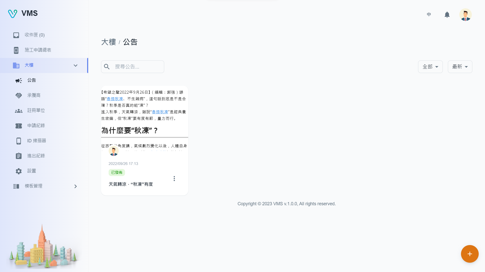

import BrowserWindow from '@site/src/components/BrowserWindow'

<BrowserWindow url={'https://vms.ces.myfiinet.com/bm/building/announcements'}>

</BrowserWindow>

# Description

The "Announcements" page on the website allows users to view building-related updates in a grid format. Users have the ability to filter the announcements by their status and sort them by published time. Users can also create, edit, or delete their own announcements on this page.

## Create

To create a announcement, the following field is required:

- Title
- Content: This field features a WYSIWYG editor that permits users to copy and paste content from the internet while maintaining its original formatting.

After completing all the required fields, users can choose to either "Save" or "Publish" the announcement.

- Save: This option indicates that the announcement will be saved but not published to the tenants.
- Publish: This option indicates that the announcement will be saved and published to the tenants.

<BrowserWindow url={'https://vms.ces.myfiinet.com/bm/building/announcements'}>

</BrowserWindow>

## Edit

When the user clicks on "Edit" in the "More" menu, the editable information of the relevant announcement will be displayed in a dialog box. All of the fields presented can be edited.

<BrowserWindow url={'https://vms.ces.myfiinet.com/bm/building/announcements'}>

</BrowserWindow>

## Delete

When the user clicks on "Delete" in the "More" menu, a warning dialog box will be displayed to double-check and alert the user that the delete action is irreversible.
