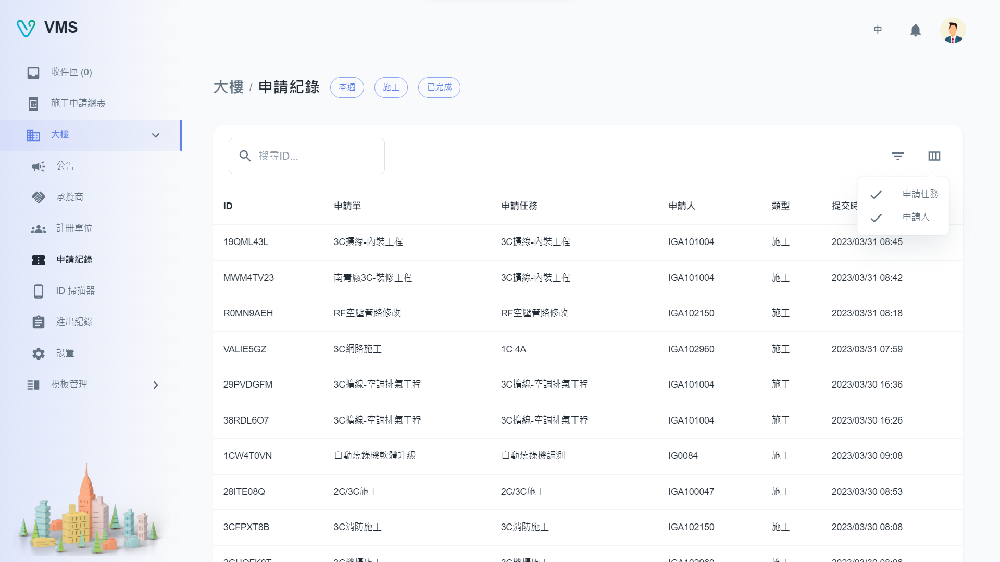

import BrowserWindow from '@site/src/components/BrowserWindow'

<BrowserWindow url={'https://vms.cesbg.efoxconn.com/bm/building/application-records'}>

</BrowserWindow>

# Description

On the "Application Record" page, users can view a table of applied tickets for the building. They have the ability to filter records based on specific conditions or ticket IDs. Additionally, users can show the "Task" and "Applicant" columns using the "Custom table columns" button.
