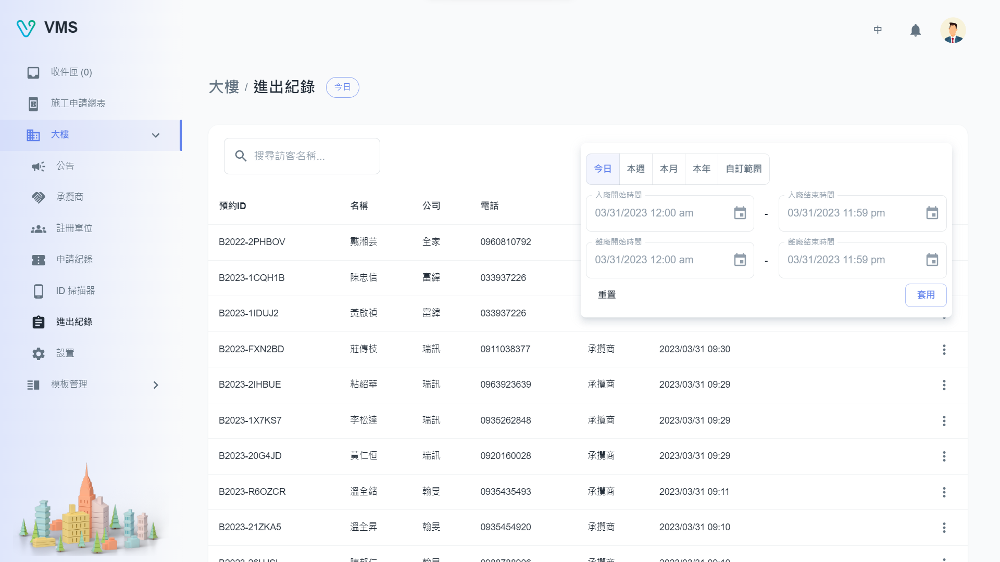

import BrowserWindow from '@site/src/components/BrowserWindow'

<BrowserWindow url={'https://vms.cesbg.efoxconn.com/bm/building/events'}>

</BrowserWindow>

# Description

On the "Events" page, users can view a table of in/out records for the building. They have the ability to filter events based on specific conditions or visitor names.
