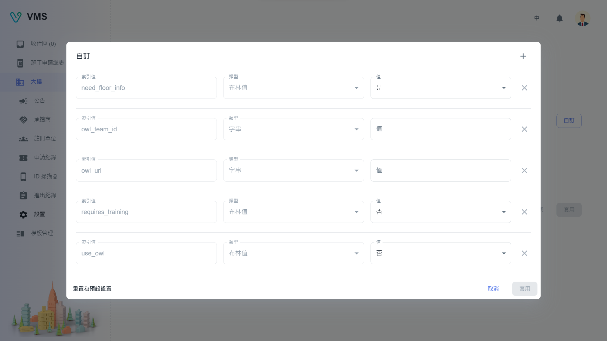

import BrowserWindow from '@site/src/components/BrowserWindow'

<BrowserWindow url={'https://vms.cesbg.efoxconn.com/bm/building/settings'}>

</BrowserWindow>

# Description

The "Settings" page comprises three tabs, including "Info", "Function Settings", and "Floor Planner".

## Info

Within the "Info" tab, users can upload a building image, as well as modify the address and Main PIC details with the approval of the administrators.

## Function Settings

Within the "Function Settings" tab, users can upload a building image, as well as modify the address and Main PIC details with the approval of the administrators.

<BrowserWindow url={'https://vms.cesbg.efoxconn.com/bm/building/settings'}>

</BrowserWindow>

<BrowserWindow url={'https://vms.cesbg.efoxconn.com/bm/building/settings'}>

</BrowserWindow>

## Floor Planner

Within the "Floor Planner" tab, users can upload a building image, as well as modify the address and Main PIC details with the approval of the administrators.

<BrowserWindow url={'https://vms.cesbg.efoxconn.com/bm/building/settings'}>

</BrowserWindow>

<BrowserWindow url={'https://vms.cesbg.efoxconn.com/bm/building/settings'}>

</BrowserWindow>
