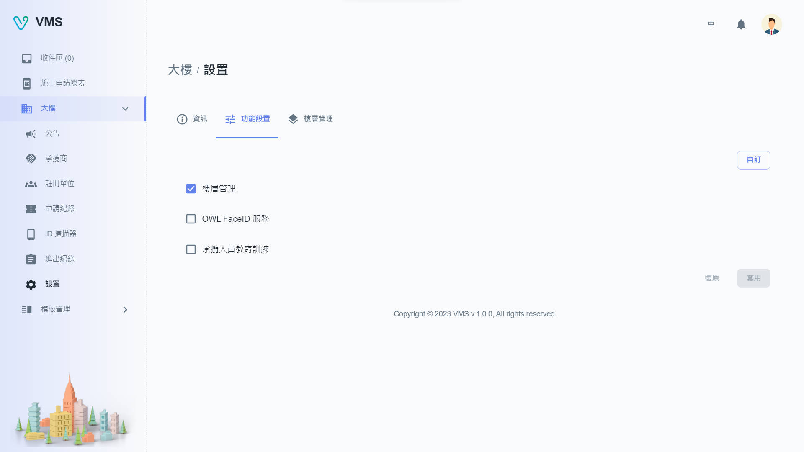

import BrowserWindow from '@site/src/components/BrowserWindow'

<BrowserWindow url={'https://vms.cesbg.efoxconn.com/bm/building/settings'}>

</BrowserWindow>

# Description

The "Settings" page comprises three tabs, including "Info", "Function Settings", and "Floor Planner".

## Info

Within the "Info" tab, users can upload a building image, as well as modify the address and Main PIC details with the approval of the administrators.

## Function Settings

The "Function Settings" tab allows users to toggle the common functions such as "Floor Planner", "OWL FaceID Service", and "Personnel Orientation" on or off. In case users require additional functions, they can contact the administrator to customize the configuration.

<BrowserWindow url={'https://vms.cesbg.efoxconn.com/bm/building/settings'}>

</BrowserWindow>

<BrowserWindow url={'https://vms.cesbg.efoxconn.com/bm/building/settings'}>

</BrowserWindow>

## Floor Planner

In the "Floor Planner" tab, users can add a new floor, upload its image, and set up the permit number as well as the list of tenants located on that floor.

<BrowserWindow url={'https://vms.cesbg.efoxconn.com/bm/building/settings'}>

</BrowserWindow>

<BrowserWindow url={'https://vms.cesbg.efoxconn.com/bm/building/settings'}>

</BrowserWindow>
