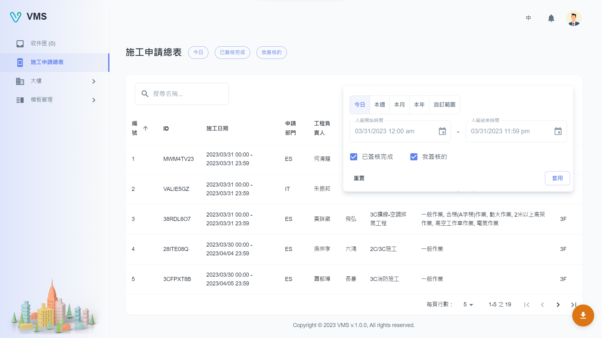

import BrowserWindow from '@site/src/components/BrowserWindow'

<BrowserWindow url={'https://vms.cesbg.efoxconn.com/bm/bookings'}>

</BrowserWindow>

# Description

The List of Construction Applications feature provides users with a variety of options for filtering and searching construction applications within a specific time range. Users can select a time frame such as today, this week, this month, this year, or set a custom range. Additionally, users can filter applications based on whether the ticket is finished or approved by the current login user. The search function allows users to find specific tickets by entering the ticket name.

Furthermore, users can export all search results with filters applied to an Excel sheet, enabling easy access and organization of data.

Overall, the List of Construction Applications feature provides users with powerful tools for managing and organizing construction applications, making it a valuable resource for construction professionals.
