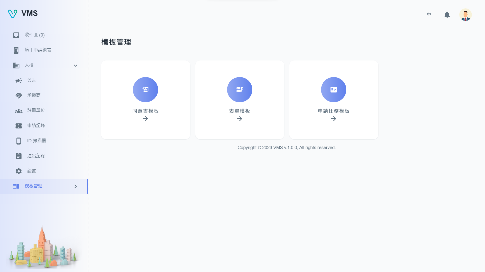

import BrowserWindow from '@site/src/components/BrowserWindow'

<BrowserWindow url={'https://vms.ces.myfiinet.com/bm/template-management'}>

</BrowserWindow>

# Description

Our "Template Management" system consists of three main features:

- Agreement Template: This feature enables users to create an agreement form that will be displayed to people who scan an access code with Upass and need to fill it out.
- Form Template: With this feature, users can create various types of forms such as general, visitor, construction, or garrison forms. These forms are used to collect information from applicants who want to access the building by scanning their access code with Upass. Each Form Template will be represented as a ticket in the tenant view.
- Task Template: This feature allows users to bind different Form Templates together as a single task in the tenant view.
