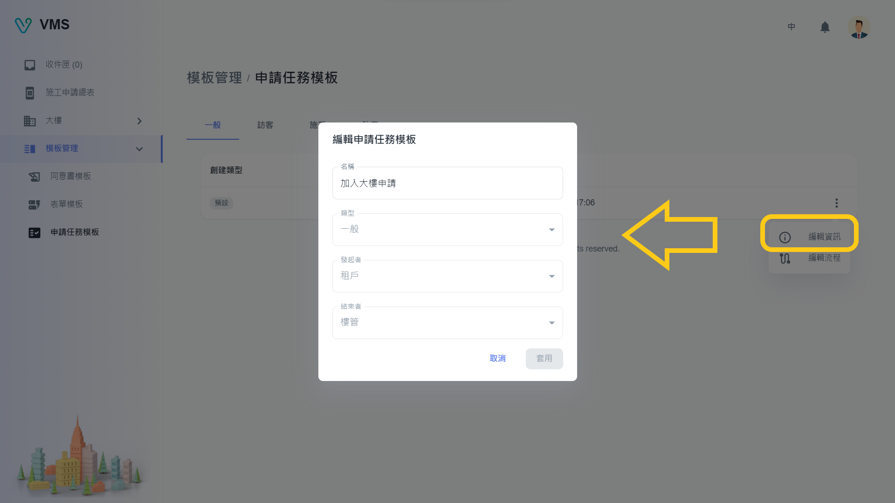

import BrowserWindow from '@site/src/components/BrowserWindow'

<BrowserWindow url={'https://vms.cesbg.efoxconn.com/bm/template-management/task-templates'}>

</BrowserWindow>

# Description

The "Task Template" page contains four tabs named General, Visitor, Construction, and Garrison. These tabs represent different types of task templates, which are combinations of form templates that are represented as tasks in the tenant view.

Each type of task template table includes the following columns:

- Create Type: This column indicates whether the task template was created by the user or is a system default template. If it is a system default template, users can only modify the name and flow of the form template.
- Name: This column displays the name of the task template.
- Create Time: This column displays the date and time when the task template was created.

Overall, the "Task Template" page offers a convenient way for users to view and manage their task templates, with options to customize and create new templates as needed.

## Edit

At present, we have only released default task templates. Users can modify the name and flow of the task template by clicking on the "More" menu in the last column of the table and selecting the desired options.

### Info

<BrowserWindow url={'https://vms.cesbg.efoxconn.com/bm/template-management/task-templates'}>

</BrowserWindow>

### Flow

Within the "Flow" dialog box, users can add stages and select form templates. Users can also decide whether each stage is optional.

<BrowserWindow url={'https://vms.cesbg.efoxconn.com/bm/template-management/task-templates'}>

</BrowserWindow>

<BrowserWindow url={'https://vms.cesbg.efoxconn.com/bm/template-management/task-templates'}>

</BrowserWindow>
