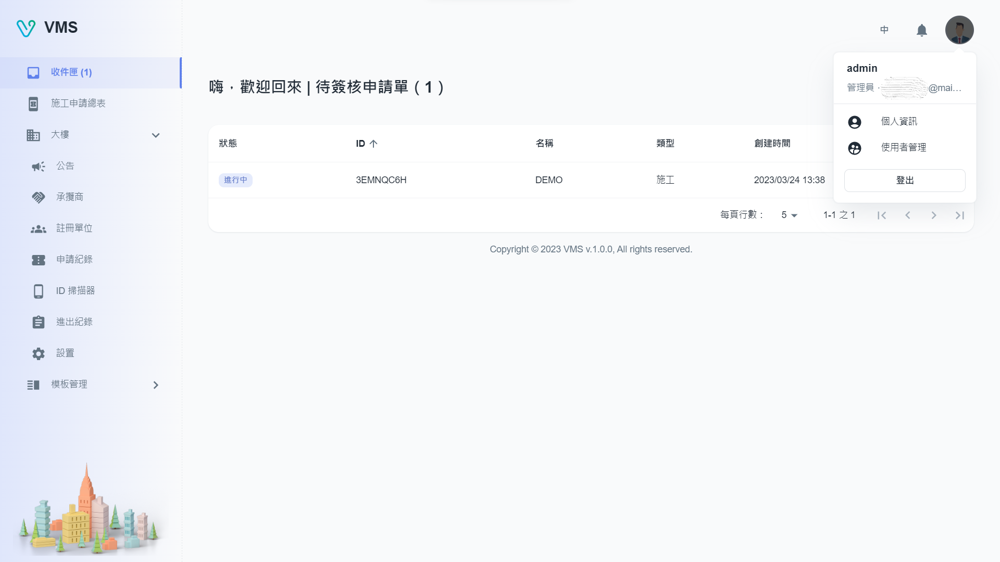
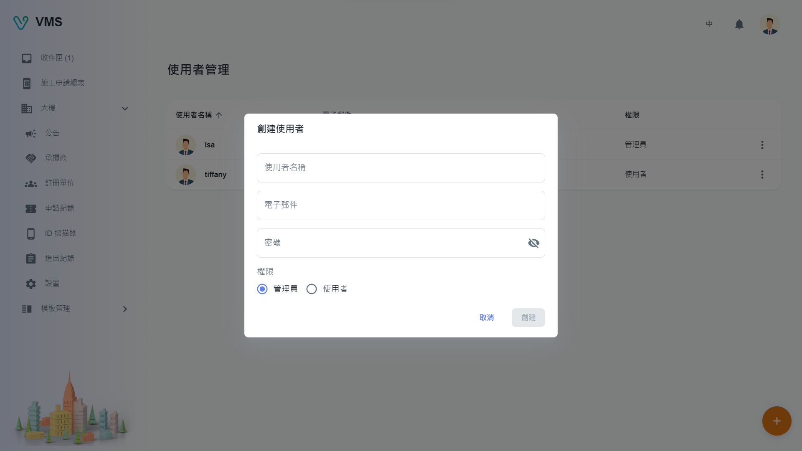

import BrowserWindow from '@site/src/components/BrowserWindow'

<BrowserWindow url={'https://vms.ces.myfiinet.com/bm/user-management'}>

</BrowserWindow>

# Description

To use VMS, users are required to verify their email first. Once verified, users can access their information by clicking on the avatar located on the upper-right corner of the window. This will display a popover menu showing the user's username, role, and email. In addition, users can find options to manage their own information as well as user management below the menu.

## Current user

The "User Info" dialog box allows users to modify their personal information such as:

- User name
- Email address
- Password

<BrowserWindow url={'https://vms.ces.myfiinet.com/bm/user-management'}>

</BrowserWindow>

## User Management

The "User Management" page provides users with the ability to add new users as either admins or regular users.

Admins have full authorization to perform CRUD (Create, Read, Update, Delete) operations on various functionalities such as:

- User management
- Announcement management
- Register unit management
- ID scanner management
- Building settings management
- Agreement template management
- Task template management
- Form template management

Regular users only have authorization to read information.

### Create

To create a user, the following field is required:

- User name
- Email address
- Password

<BrowserWindow url={'https://vms.ces.myfiinet.com/bm/user-management'}>

</BrowserWindow>

### Edit

When the user clicks on "Edit" in the "More" menu, the editable information of the relevant user will be displayed in a dialog box. All of the fields presented can be edited.

<BrowserWindow url={'https://vms.ces.myfiinet.com/bm/user-management'}>

</BrowserWindow>

### Delete

When the user clicks on "Delete" in the "More" menu, a warning dialog box will be displayed to double-check and alert the user that the delete action is irreversible.
