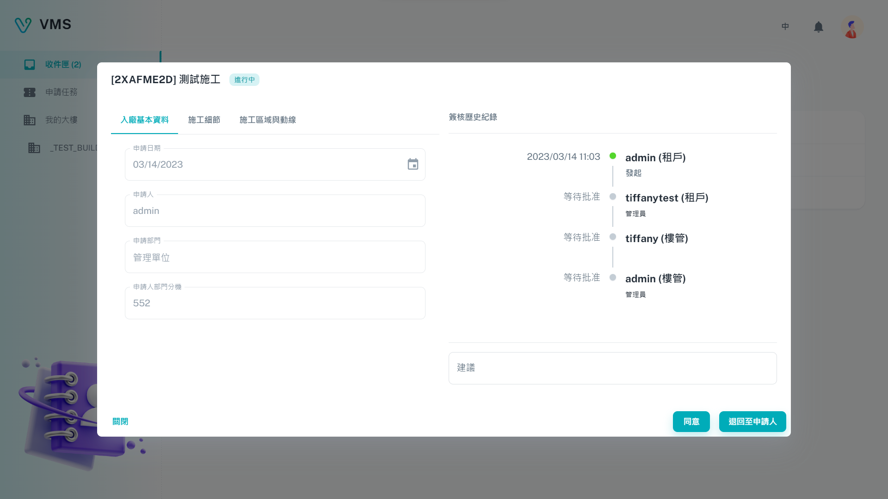

import BrowserWindow from '@site/src/components/BrowserWindow'

<BrowserWindow url={'https://vms.cesbg.efoxconn.com/vms/inbox'}>

</BrowserWindow>

# Description

The "Inbox" page enables users to receive tickets related to building access. Users can click on the tickets displayed in a table to view more details about them. In the ticket dialog box, users have the option to either "Agree" or "Reject the applicant".

<BrowserWindow url={'https://vms.cesbg.efoxconn.com/vms/inbox'}>

</BrowserWindow>
