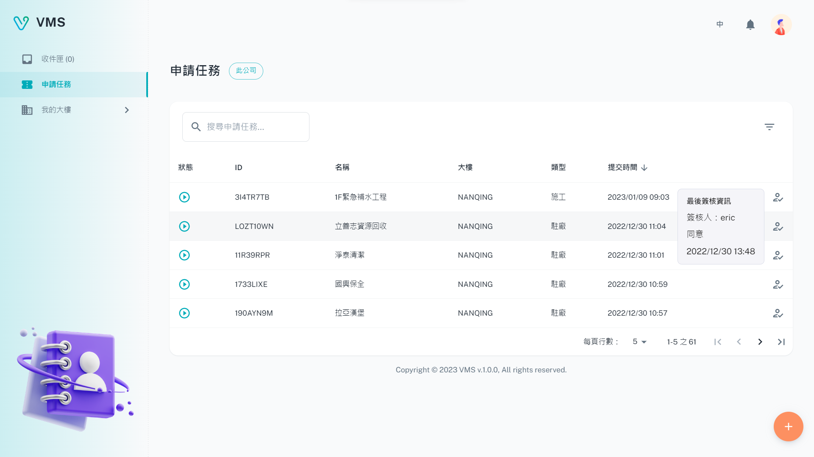

import BrowserWindow from '@site/src/components/BrowserWindow'

<BrowserWindow url={'https://vms.ces.myfiinet.com/vms/tasks'}>

</BrowserWindow>

# What is Tenant?

The Visitor Management System (VMS) enables tenants to associate with buildings and request access to the building. Additionally, tenants can manage their visitors' information, including visitor history. The system allows tenants to create both admin and regular user accounts to facilitate their unique approval processes for various tasks.
