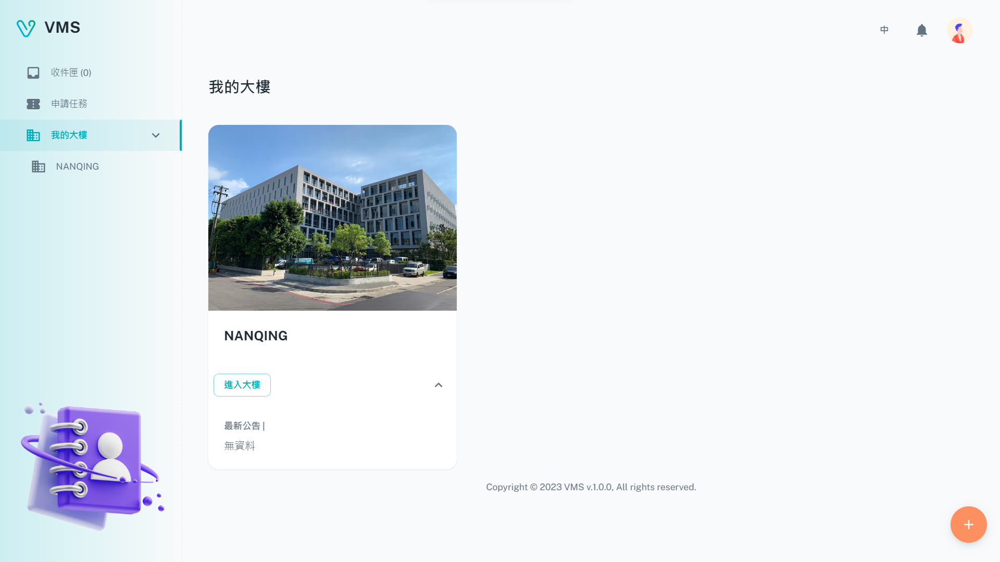

import BrowserWindow from '@site/src/components/BrowserWindow'

<BrowserWindow url={'https://vms.cesbg.efoxconn.com/vms/my-buildings'}>

</BrowserWindow>

# Description

The **My Buildings** page allows users to access the latest announcements for the buildings where they have already registered themselves as a unit, and apply to register themselves as a unit with additional buildings.

## Building Information

After the user clicks on the **Enter Building** button, they will be able to access all the relevant information related to the building, such as announcements, contractors, and personnel details.

<BrowserWindow url={'https://vms.cesbg.efoxconn.com/vms/my-buildings/{buildingId}'}>

</BrowserWindow>

<BrowserWindow url={'https://vms.cesbg.efoxconn.com/vms/my-buildings/{buildingId}'}>

</BrowserWindow>

<BrowserWindow url={'https://vms.cesbg.efoxconn.com/vms/my-buildings/{buildingId}'}>

</BrowserWindow>
