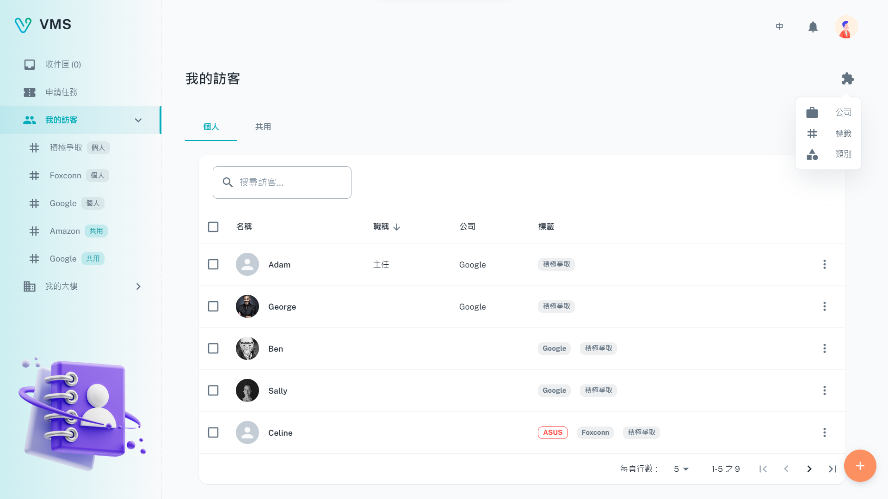
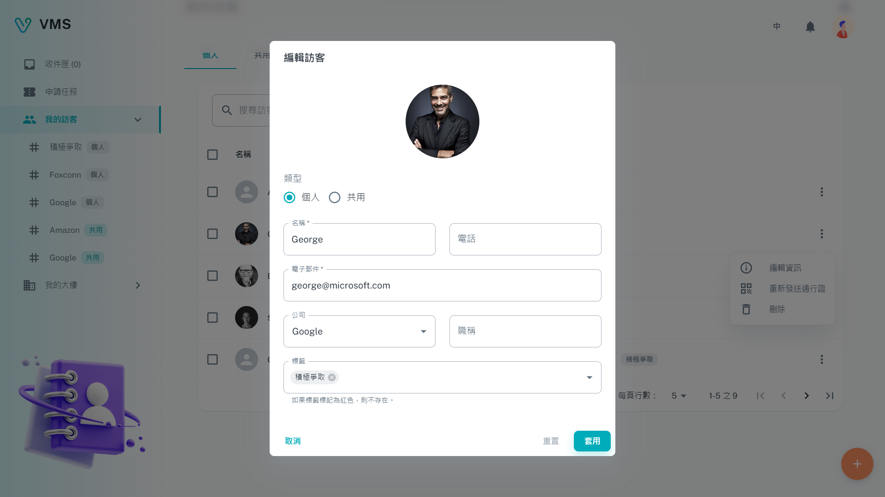
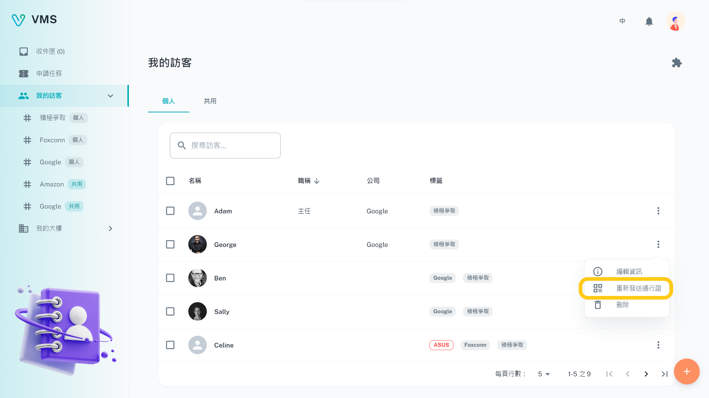
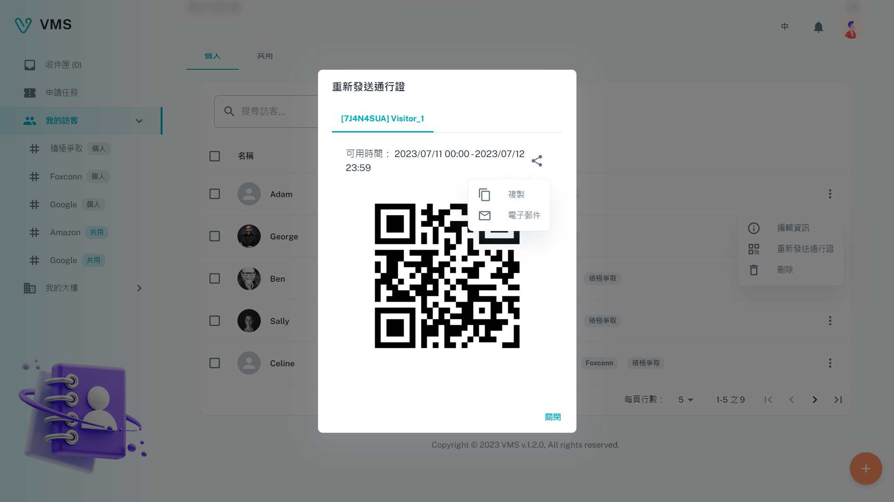
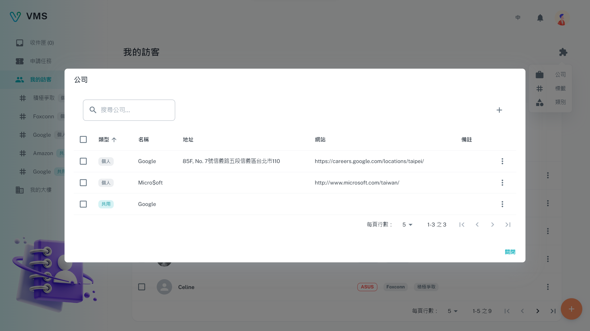

import BrowserWindow from '@site/src/components/BrowserWindow'

<BrowserWindow url={'https://vms.cesbg.efoxconn.com/vms/my-visitors'}>

</BrowserWindow>

# Description

The **My Visitors** page provides users with the ability to manage their visitors. This includes adding, editing, and deleting visitors. Users can also search for visitors by their name. Additionally, the page allows users to share their visitors with others within the same company. On this page, visitors can organized into three categories: `Companies`, `Tags`, and `Categories`.

## Visitors

The page includes a table that displays the following columns:

- Avatar & Name
- Job title
- Company
- Tag

### Create

To create a visitor, users must provide the following information:

- Type: Indicates the type of visitor being requested.
- Name: Specifies a unique name for the visitor.
- Email: a email address that will be used to send the entry pass QR code.

The following fields are optional:

- Phone
- Company
- Job Title
- Tags

<BrowserWindow url={'https://vms.cesbg.efoxconn.com/vms/my-visitors'}>

</BrowserWindow>

### Edit

When the user clicks on "Edit Info" in the "More" menu, the editable information of the relevant visitor will be displayed in a dialog box. All of the fields presented can be edited.

<BrowserWindow url={'https://vms.cesbg.efoxconn.com/vms/my-visitors'}>

</BrowserWindow>

### Resend Pass

When the user clicks on "Resend Pass" in the "More" menu, a dialog box will be displayed showing a list of related booking records to the visitor. It can be shared via copy or email.

<BrowserWindow url={'https://vms.cesbg.efoxconn.com/vms/my-visitors'}>

</BrowserWindow>

<BrowserWindow url={'https://vms.cesbg.efoxconn.com/vms/my-visitors'}>

</BrowserWindow>

### Delete

When the user clicks on "Delete" in the "More" menu, a warning dialog box will be displayed to double-check and alert the user that the delete action is irreversible.

<BrowserWindow url={'https://vms.cesbg.efoxconn.com/vms/my-visitors'}>

</BrowserWindow>

## Extensions

### Companies

This is a list that can be utilized for managing companies. Companies can be added, edited, and deleted from this list. Any modifications made to the companies will automatically synchronize with the corresponding visitor records.

<BrowserWindow url={'https://vms.cesbg.efoxconn.com/vms/my-visitors'}>

</BrowserWindow>

#### Create

To create a company, the following fields are required:

- Type
- Name

The following fields are optional:

- Address
- Website
- Note

#### Edit

When the user clicks on "Edit Info" in the "More" menu, the editable information of the relevant company will be displayed in a dialog box. All of the fields presented can be edited.

#### Delete

When the user clicks on "Delete" in the "More" menu, a warning dialog box will be displayed to double-check and alert the user that the delete action is irreversible.

### Tags

This is a list specifically designed for tagging visitors. Tags can be added, edited, and deleted within this list. Any changes made to the tags will automatically synchronize with the corresponding visitor records.

<BrowserWindow url={'https://vms.cesbg.efoxconn.com/vms/my-visitors'}>

</BrowserWindow>

#### Create

To create a tag, the following fields are required:

- Type
- Name

The following fields are optional:

- Description

#### Edit

When the user clicks on "Edit Info" in the "More" menu, the editable information of the relevant tag will be displayed in a dialog box. All of the fields presented can be edited.

#### Delete

When the user clicks on "Delete" in the "More" menu, a warning dialog box will be displayed to double-check and alert the user that the delete action is irreversible.

### Categories

This is a categories list that can be used to in the `visit` tickets. The categories can be added, edited, and deleted.

<BrowserWindow url={'https://vms.cesbg.efoxconn.com/vms/my-visitors'}>

</BrowserWindow>

#### Create

To create a category, the following fields are required:

- Name

#### Edit

When the user clicks on "Edit Info" in the "More" menu, the editable information of the relevant category will be displayed in a dialog box. All of the fields presented can be edited.

#### Delete

When the user clicks on "Delete" in the "More" menu, a warning dialog box will be displayed to double-check and alert the user that the delete action is irreversible.
