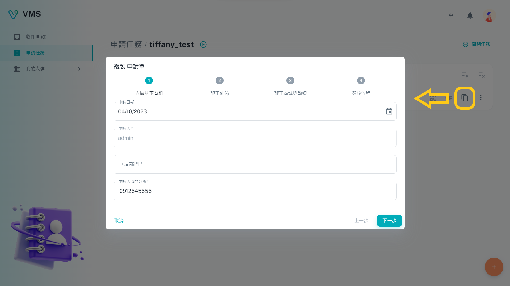

import BrowserWindow from '@site/src/components/BrowserWindow'

<BrowserWindow url={'https://vms.cesbg.efoxconn.com/vms/tasks'}>

</BrowserWindow>

# Description

The **Task** functionality is an essential component of the Tenant portal, providing users with the ability to generate requests for building access for a variety of purposes, such as `general`, `visitor`, `construction`, and `garrison`. It's worth noting that each task is comprised of multiple **tickets**.

## Task

The page includes a table that displays the following columns:

- Status: Indicates the current status of the task, which can be one of four options: `Opened`, `Error`, `Locked`, or `Closed`.
- ID
- Name
- Building: Specifies the building associated with the task.
- Type: Indicates the type of the task, which can be one of four options: `general`, `visitor`, `contruction`, or `garrison`.
- Submit time
- Latest approval information: Displays the most recent approval details for the task.
  Additionally, users can search for a specific task name or apply filters based on specific conditions to locate tasks.

### Create

To create a task, users must provide the following information:

- Building: Specifies the building to which the user is requesting access.
- Type: Indicates the type of task being requested.
- Task: Outlines the specific task flow, as provided by BM.
- Name: Specifies a unique name for the task.

<BrowserWindow url={'https://vms.cesbg.efoxconn.com/vms/tasks'}>

</BrowserWindow>

### Status

Once a task is created, it will appear in the table with one of the following statuses:

- `Opened`: This is the default status for a newly created task.
- `Error`: This status indicates that an error has occurred with the task. Users can view the details in the tooltip within the chip and should report the issue to their admin.
- `Locked`: This status denotes that an admin has locked the task, preventing any further modifications or closures.
- `Closed`: This status indicates that the task has been closed, and no new tickets can be added. Users can close the task by clicking the **Close Task** button on the detail page, and once a task is closed, it cannot be reopened.

## Ticket

On the task detail page, users will see a title with the task name and status icon, along with a Close Task button. Below this, a table with relevant tickets will be displayed, featuring the following columns:

- Status: Indicates the status of the ticket, which can be one of seven options: `Standby`, `Standby Ready`, `Error`, `Running`, `Declined`, `Cancelled`, or `Done`.
- ID
- Subject: Specifies the name of the ticket.
- Building: Identifies the building associated with the ticket.
- Type: Indicates the type of the ticket, which can be one of four options: `general`, `visitor`, `construction`, or `garrison`. This is typically the same as the task type.
- Submit Time
- Actions: There will be four buttons:
  - `QR Code`: Generates a QR code for the ticket that can be scanned to view the ticket details without logging in. This QR code can also be saved as a PDF file.
  - `Attachments`: Displays any relevant attachments for the ticket, which can be downloaded once the ticket is marked as "Done".
  - `Copy`: Allows users to create a copy of the desired ticket.
  - `More`: Provides additional actions that can be performed on the ticket.

By clicking on a ticket row, a dialog box will pop up containing all the information related to the ticket.

<BrowserWindow url={'https://vms.cesbg.efoxconn.com/vms/tasks/{taskId}'}>

</BrowserWindow>

### Create or Copy

Users can create or copy a ticket only when all the existing tickets' statuses are either "Running", "Done", or "Cancelled".

#### Create

To create a ticket, users must provide the following information:

- Form Template: Specifies the form template that the user wants to apply.
- Name: Specifies a unique name for the ticket.

After providing the required information, users can create the ticket by clicking the "➕" button located in the lower-right corner of the screen. The newly created ticket will be added to the table on the task detail page with an initial status of **Standby Ready**.

<BrowserWindow url={'https://vms.cesbg.efoxconn.com/vms/tasks/{taskId}'}>

</BrowserWindow>

#### Copy

To create a new ticket, users can also simply click the **Copy** button located in the last column of the desired ticket row. This will copy the content of the ticket and open a new ticket creation form with the copied information pre-filled. Users can then easily modify any pertinent details as needed before proceeding with submitting the new ticket.

<BrowserWindow url={'https://vms.cesbg.efoxconn.com/vms/tasks/{taskId}'}>

</BrowserWindow>

### Status

After created, task will be found in the table. But now it not start running tickets. Users have to click into the detail page, and will see a table of relevant tickets. In the last column of the table head, will see two buttons: `Start all tickets` and `Closed all tickets`.

<BrowserWindow url={'https://vms.cesbg.efoxconn.com/vms/tasks/{taskId}'}>

</BrowserWindow>
