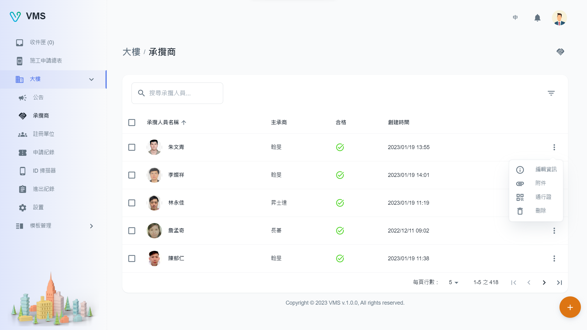
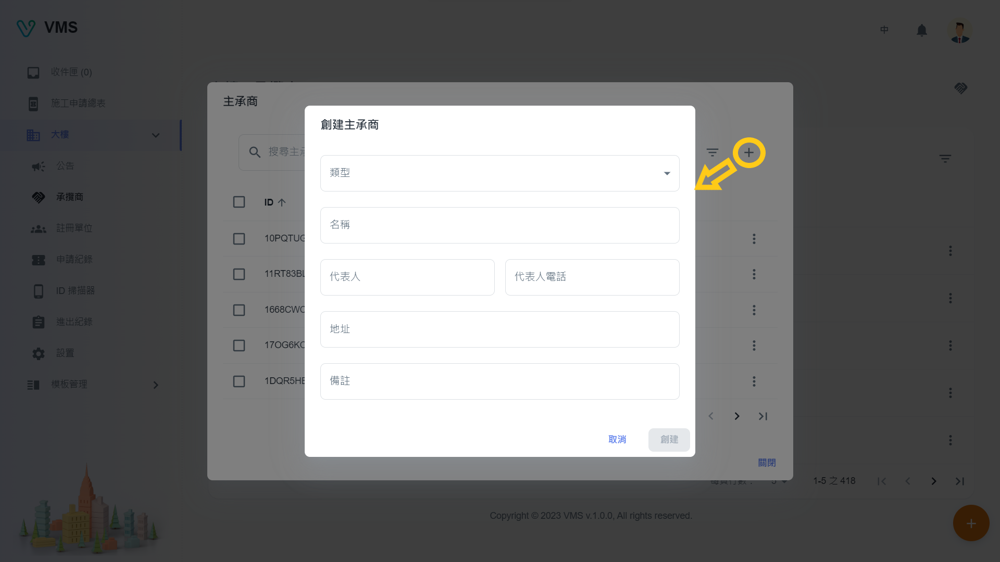
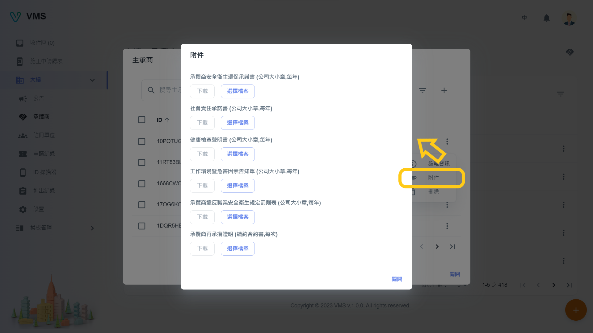
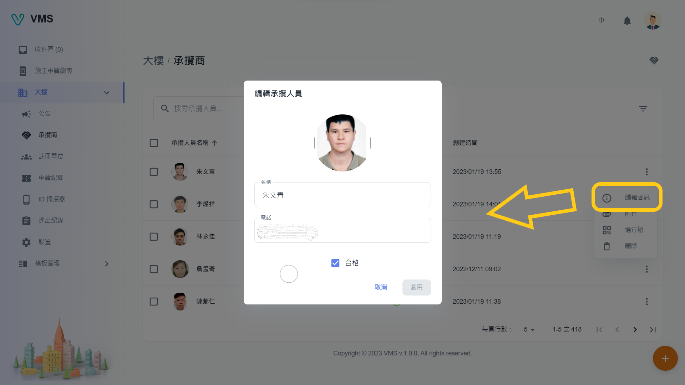
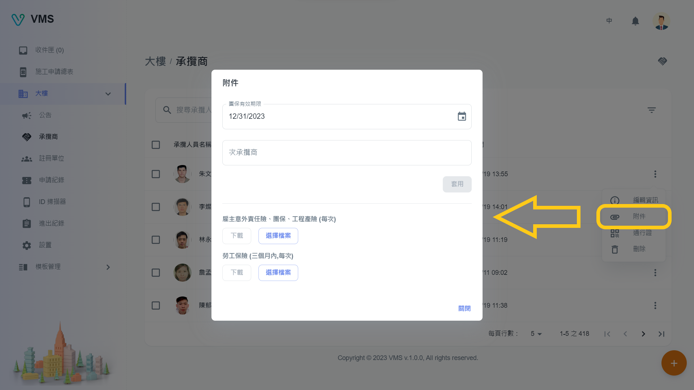
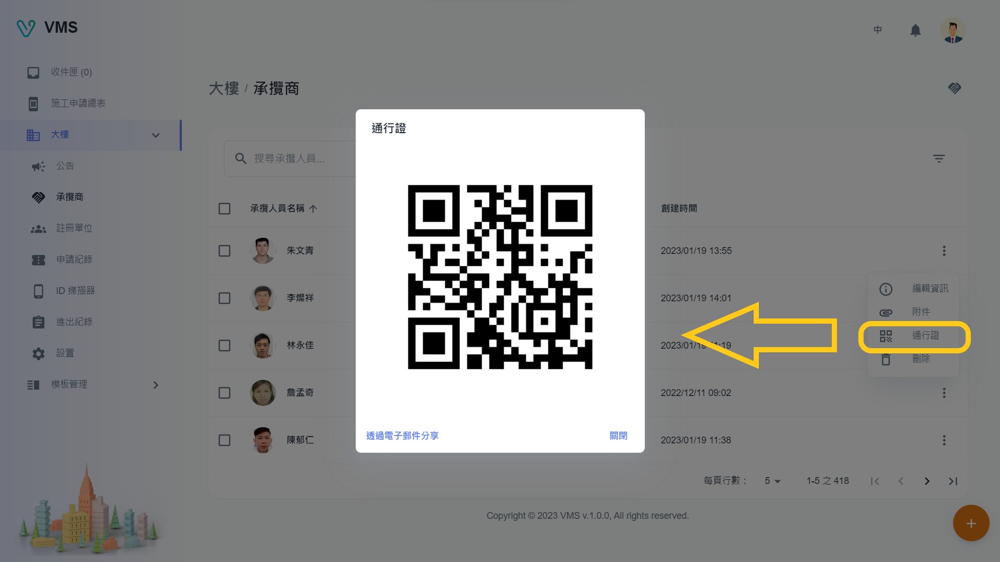
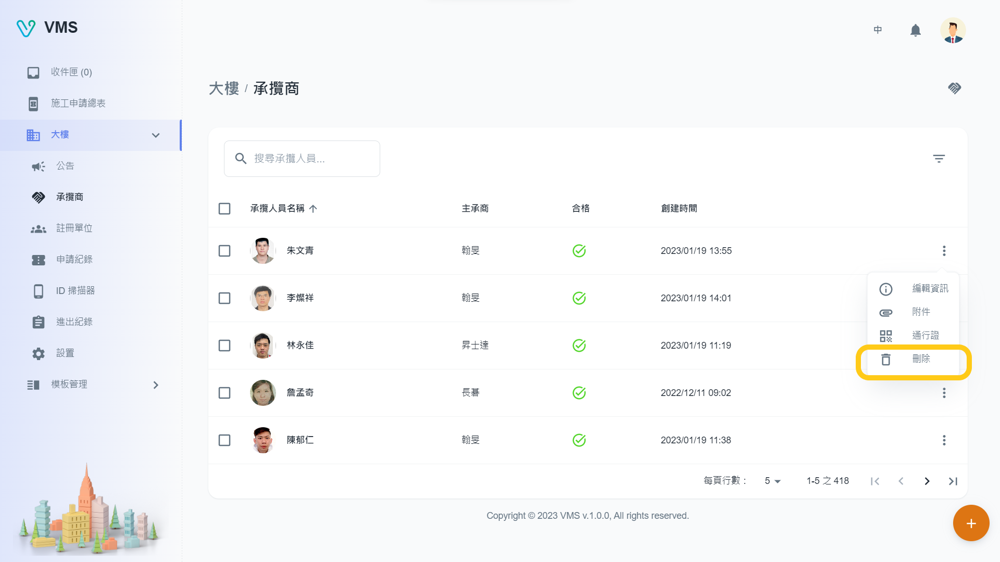

import BrowserWindow from '@site/src/components/BrowserWindow'

<BrowserWindow url={'https://vms.cesbg.efoxconn.com/bm/building/contractors'}>

</BrowserWindow>

＃ 描述

在“承揽商”页面上，用户可以查看与大楼相关的“承揽人员”表。他们能够根据特定条件或姓名过滤人员，为每个人执行 CRUD（创建、读取、更新、删除）功能，上传附件，并检视通行码。通过点击位于右上角的按钮（🤝），用户可以访问“承揽商”对话框。在此对话框中，用户可以根据特定条件或名称应用其他过滤器、使用 CRUD 功能管理承揽商以及上传附件。

## 打开承揽商

在创建人员之前，需要先创建承揽商，用户可以点击位于右上角的“承揽商”按钮 (🤝)，这会打开一个对话框。该对话框显示可用承揽商表，以及用于查找特定承揽商的搜索栏和过滤器选项。要添加新承揽商，用户可以点击“添加”按钮 (➕)。

<BrowserWindow url={'https://vms.cesbg.efoxconn.com/bm/building/contractors'}>

</BrowserWindow>

## 承揽商

在 VMS 中，租户可以为“施工”和“驻厂”类型的施工单选择承揽商。

:::note
在 BM 中所有承揽商都被认为是合格的。
:::

### 创建

要创建承揽商，需要以下栏位：

- 类型
- 姓名
- 代表人
- 代表人电话

以下栏位为选填：

- 地址
- 备注

<BrowserWindow url={'https://vms.cesbg.efoxconn.com/bm/building/contractors'}>

</BrowserWindow>

:::note
当用户点击承揽商表中的“更多”按钮时，每行末尾都会显示“编辑资讯”、“附件”、“删除”等相关选项。
:::

### 编辑

当用户点击“更多”选单中的“编辑”时，会在对话框中显示相关承揽商的可编辑信息。所有显示的栏位都可以编辑。

<BrowserWindow url={'https://vms.cesbg.efoxconn.com/bm/building/contractors'}>

</BrowserWindow>

### 上传附件

当用户点击“更多”选单中的“附件”时，将显示一个对话框，显示承揽商必须上传的附件才能成为合格厂商。

<BrowserWindow url={'https://vms.cesbg.efoxconn.com/bm/building/contractors'}>

</BrowserWindow>

### 删除

当用户点击“更多”选单中的“删除”时，会弹出一个警告对话框，再次确认并提醒用户删除操作不可逆。

<BrowserWindow url={'https://vms.cesbg.efoxconn.com/bm/building/contractors'}>

</BrowserWindow>

## 承揽人员

在 VMS 中，租户可以为“施工”和“驻厂”类型的施工单选择承揽人员。

:::note
在 BM 中所有承揽人员都被认为是合格的。
:::

### 创建

要创建承揽人员，需要以下栏位：

- 大头照
- 所属承揽商
- 名称

以下栏位为选填：

- 电话
- 合格

<BrowserWindow url={'https://vms.cesbg.efoxconn.com/bm/building/contractors'}>

</BrowserWindow>

### 编辑

当用户点击“更多”选单中的“编辑”时，会在对话框中显示相关承揽人员的可编辑信息。所有显示的栏位都可以编辑。

<BrowserWindow url={'https://vms.cesbg.efoxconn.com/bm/building/contractors'}>

</BrowserWindow>

### 上传附件

当用户点击“更多”选单中的“附件”时，将显示一个对话框，显示承揽人员必须上传的附件才能成为合格人员。

<BrowserWindow url={'https://vms.cesbg.efoxconn.com/bm/building/contractors'}>

</BrowserWindow>

### 通行码

通行码可以与 Upass 配合使用，能够显示人员可以通行的申请单。一旦通过，VMS 将在“进出纪录”和“ID 扫描器”页面中留下记录。通行码可以通过电子邮件共享或下载图像。

<BrowserWindow url={'https://vms.cesbg.efoxconn.com/bm/building/contractors'}>

</BrowserWindow>

### 删除

当用户点击“更多”选单中的“删除”时，会弹出一个警告对话框，再次确认并提醒用户删除操作不可逆。

<BrowserWindow url={'https://vms.cesbg.efoxconn.com/bm/building/contractors'}>

</BrowserWindow>
