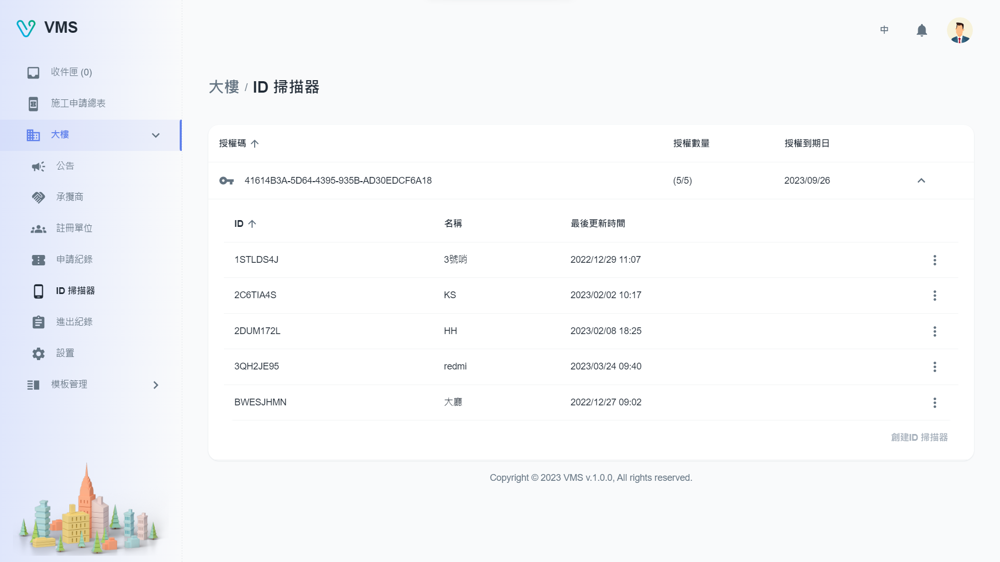
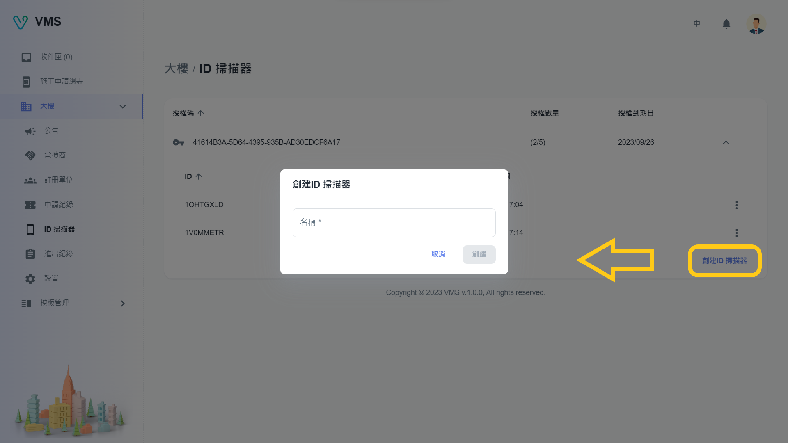
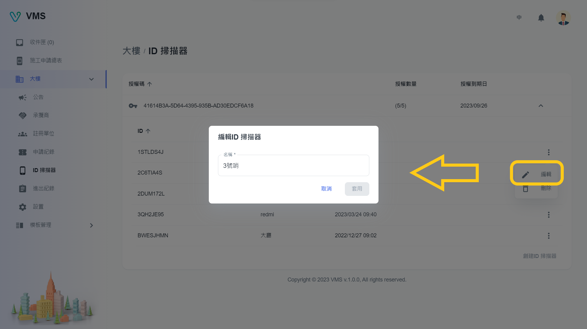

import BrowserWindow from '@site/src/components/BrowserWindow'

<BrowserWindow url={'https://vms.ces.myfiinet.com/bm/building/scanners'}>

</BrowserWindow>

# 描述

在“ID 扫描器”，用户可以查看大楼可用的 ID 扫描器。用户可以使用提供的授权码为大楼创建 ID 扫描器，每组授权码皆有一定的可用数量和到期日期。在每个授权码下，用户可以看到可用 ID 扫描器，包括他们的 ID、名称和最后更新时间。最后一列中的“更多”按钮提供了编辑或删除 ID 扫描器的选项。

:::note
如果您需要额外的授权码，请联系我们。
:::

## 创建

要创建扫描器，需要以下栏位：

- 名称

以下栏位为选填：

- OWL 协力单元 ID（仅当大楼具有 OWL 模组时才会出现）

<BrowserWindow url={'https://vms.ces.myfiinet.com/bm/building/scanners'}>

</BrowserWindow>

## 编辑

当用户点击“更多”选单中的“编辑”时，会在对话框中显示相关扫描器的可编辑信息。所有显示的栏位都可以编辑。

<BrowserWindow url={'https://vms.ces.myfiinet.com/bm/building/scanners'}>

</BrowserWindow>

## 删除

当用户点击“更多”选单中的“删除”时，会弹出一个警告对话框，再次确认并提醒用户删除操作不可逆。
