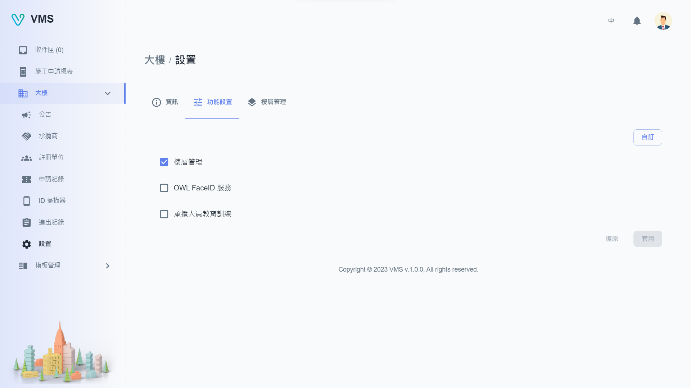
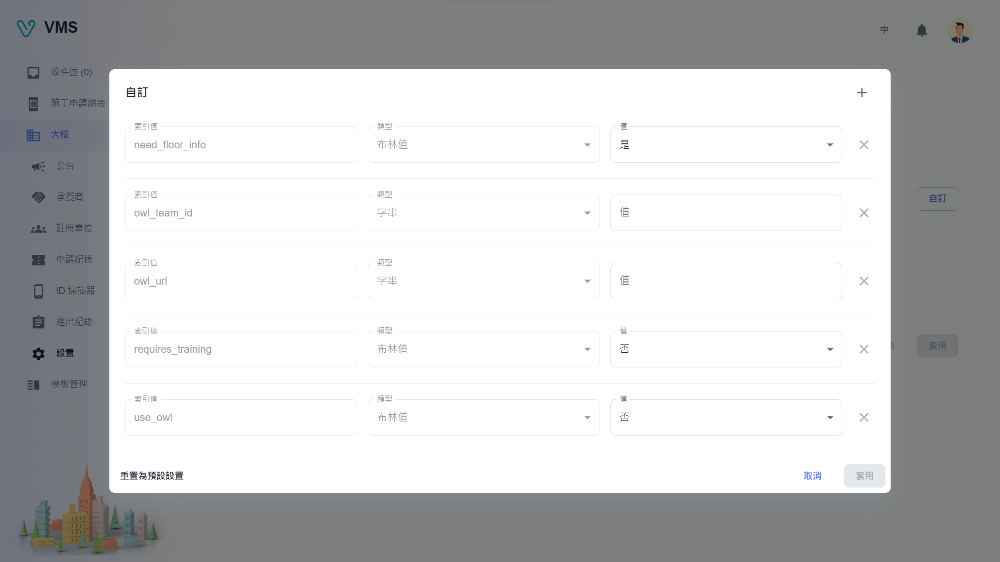

import BrowserWindow from '@site/src/components/BrowserWindow'

<BrowserWindow url={'https://vms.cesbg.efoxconn.com/bm/building/settings'}>

</BrowserWindow>

# 描述

“设置” 包含 “资讯”、“功能设置”、“楼层管理” 三个分页。

## 资讯

用户可以上传大楼照片，也可以修改地址和堡主。

## 功能设置

允许用户打开或关闭“楼层管理”、“OWL FaceID 服务”和“承揽人员教育训练”等常用功能。如果用户需要额外的功能，他们可以联系管理员做自定义配置。

<BrowserWindow url={'https://vms.cesbg.efoxconn.com/bm/building/settings'}>

</BrowserWindow>

<BrowserWindow url={'https://vms.cesbg.efoxconn.com/bm/building/settings'}>

</BrowserWindow>

## 楼层管理

用户可以添加新楼层、上传图片、通行码以及位于该楼层的租户列表。

<BrowserWindow url={'https://vms.cesbg.efoxconn.com/bm/building/settings'}>

</BrowserWindow>

<BrowserWindow url={'https://vms.cesbg.efoxconn.com/bm/building/settings'}>

</BrowserWindow>
