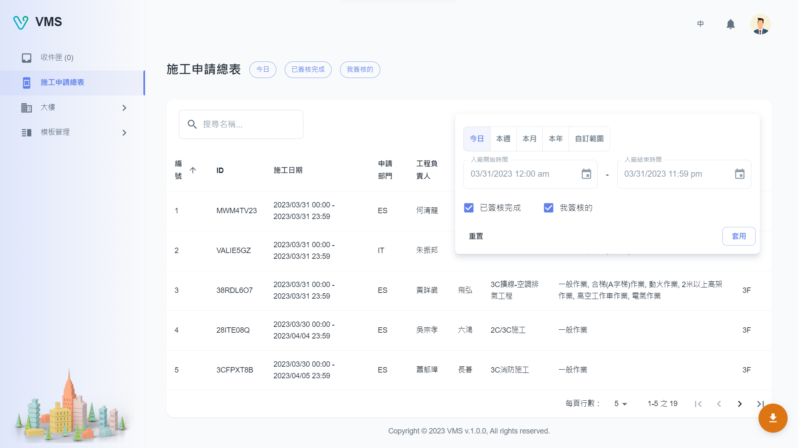

import BrowserWindow from '@site/src/components/BrowserWindow'

<BrowserWindow url={'https://vms.cesbg.efoxconn.com/bm/bookings'}>

</BrowserWindow>

＃ 描述

**施工申请总表**为用户提供了多种选项，用于过滤和搜索特定时间范围内的大楼申请单。用户可以选择今天、本周、本月、今年等时间范围，也可以设置自定义范围。此外，用户可以根据申请单是否为已完成或当前用户签核来过滤。搜索功能允许用户通过输入申请单名称来查找。

此外，用户可以将所有搜索结果输出为 Excel 工作表，进而分析或统计。
