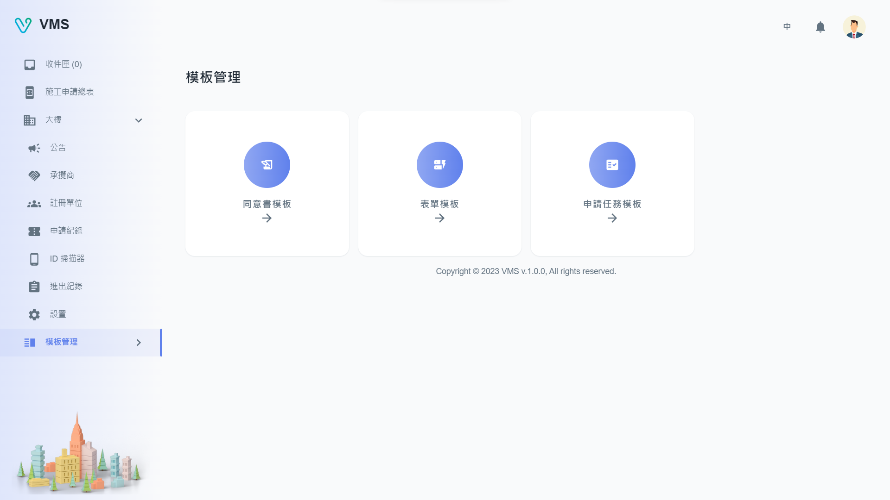

import BrowserWindow from '@site/src/components/BrowserWindow'

<BrowserWindow url={'https://vms.cesbg.efoxconn.com/bm/template-management'}>

</BrowserWindow>

# 描述

“模板管理”包括三个主要功能：

- 同意书模板：用户可创建一个同意书表单，此表单包含签名栏位。
- 表单模板：用户可创建各种类型的表单，例如一般、访客、施工或驻厂。这些表单用于收集申请进入大楼的申请人信息。每个表单模板将在租户介面将以申请单呈现。
- 申请任务模板：允许用户将不同的表单模板绑定在一起，在租户介面将以申请任务呈现。