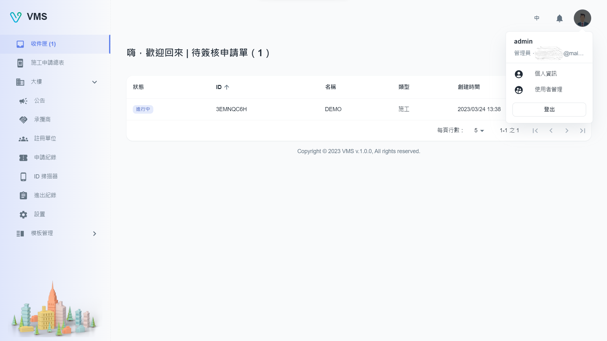
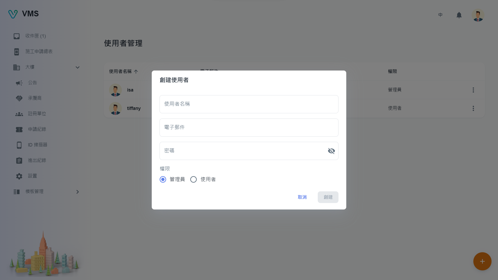

import BrowserWindow from '@site/src/components/BrowserWindow'

<BrowserWindow url={'https://vms.cesbg.efoxconn.com/bm/user-management'}>

</BrowserWindow>

# 描述

开始使用 VMS 前，用户需要先验证他们的电子邮件。一旦通过验证，可通过右上角的头像来检视个人资讯。内含：用户名称、权限和电子邮件。此外，在下方可以找到`个人资讯`和`用户管理`。

## 当前用户

“个人资讯”允许用户修改他们的个人信息，例如：

- 用户名称
- 电子邮件
- 密码

<BrowserWindow url={'https://vms.cesbg.efoxconn.com/bm/user-management'}>

</BrowserWindow>

## 用户管理

“用户管理”提供了建立用户为管理员或普通用户的功能。

管理员拥有执行各种功能的完整权限，包括：

- 用户管理
- 大楼管理
- 模板管理

普通用户只有检视权限。

### 创建

要创建用户，需要以下栏位：

- 用户名称
- 电子邮件
- 密码
- 权限

<BrowserWindow url={'https://vms.cesbg.efoxconn.com/bm/user-management'}>

</BrowserWindow>

### 编辑

当用户点击“更多”选单中的“编辑”时，会在对话框中显示相关用户的可编辑信息。所有显示的栏位都可以编辑。

<BrowserWindow url={'https://vms.cesbg.efoxconn.com/bm/user-management'}>

</BrowserWindow>

### 删除

当用户点击“更多”选单中的“删除”时，会弹出一个警告对话框，再次确认并提醒用户删除操作不可逆。
