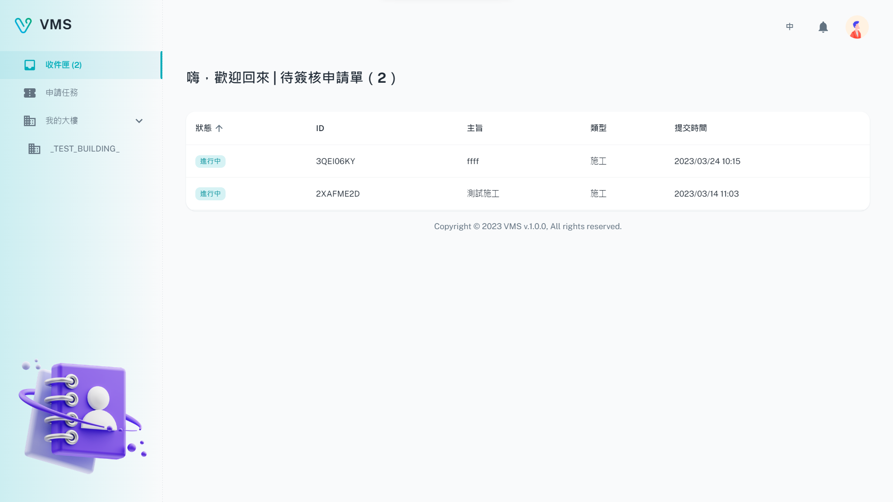
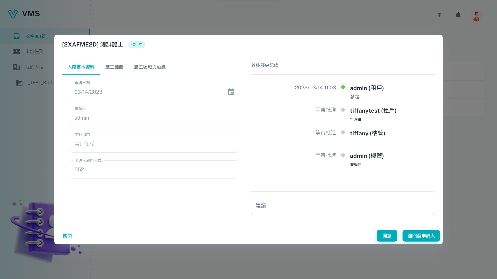

import BrowserWindow from '@site/src/components/BrowserWindow'

<BrowserWindow url={'https://vms.cesbg.efoxconn.com/vms/inbox'}>

</BrowserWindow>

# 描述

在"收件匣"，使用者可以接收与大楼相关的申请单。使用者可以点击表格中显示的申请单以查看更多详细信息。在申请单中，使用者可以选择“同意”或“退回至申请人”。

<BrowserWindow url={'https://vms.cesbg.efoxconn.com/vms/inbox'}>

</BrowserWindow>