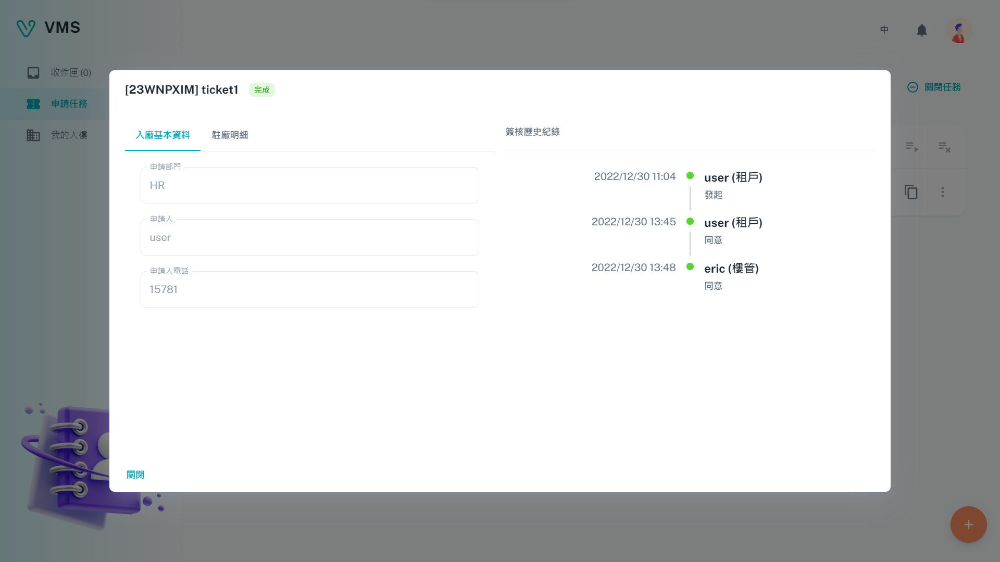
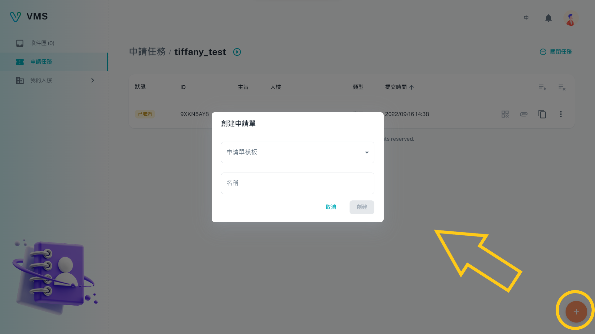
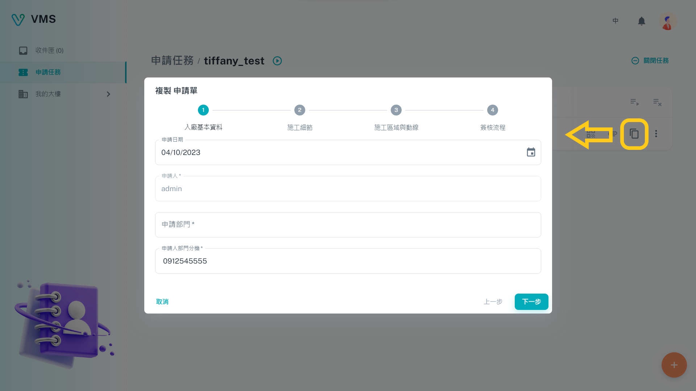

import BrowserWindow from '@site/src/components/BrowserWindow'

<BrowserWindow url={'https://vms.cesbg.efoxconn.com/vms/tasks'}>

</BrowserWindow>

# 描述

**申请任务**是租户的重要功能，提供用户建立多种用途的进入大楼许可请求，例如`一般`、`访客`、`施工`和`驻厂`。值得注意的是，每个任务由多个**申请单**组成。

## 申请任务

此页面包含一个表格，显示以下列：

- 状态：显示当前任务的状态，可以是四种选项之一：`已开启`、`错误`、`已锁定`或`已关闭`。
- ID
- 名称
- 大楼：指定与任务相关的大楼。
- 类型：指示任务的类型，为以下四种：`一般`、`访客`、`施工`和`驻厂`。
- 提交时间
- 最新签核资讯：显示任务的最新签核简要信息。

此外，使用者可以搜寻特定任务名称或根据特定条件应用筛选器以找寻任务。

### 创建

创建任务时，用户必须提供以下信息：

- 大楼：指定用户正在请求访问的大楼。
- 类型：表示正在建立的任务类型。
- 申请任务：概述了由 BM 提供的任务流程。
- 名称：任务名称。

<BrowserWindow url={'https://vms.cesbg.efoxconn.com/vms/tasks'}>

</BrowserWindow>

### 状态

一旦创建了任务，它将出现在表格中，并显示以下其中一个状态：

- `已开启`：这是新创建任务的默认状态。
- `错误`：此状态表示任务发生了错误。用户可以在状态提示中查看详细信息，并应向其管理员回报问题。
- `已锁定`：此状态表示管理员已锁定任务，防止进行任何进一步的修改或关闭。
- `已关闭`：此状态表示任务已关闭，且不能再添加新的申请单。用户可以通过单击详细页面上的**关闭任务**按钮来关闭，一旦任务被关闭，就无法重新打开。

## 申请单

在任务详细页面上，用户将看到包含任务名称和状态图示的标题，以及一个关闭任务按钮。在此下方，将显示一个包含相关申请单的表格，其中包括以下列：

- 状态：指示申请单的状态，可以是以下七种之一：`准备中`、`准备完成`、`错误`、`进行中`、`已拒绝`、`已取消`或`已完成`。
- ID
- 主旨：指定申请单的名称。
- 大楼：与申请单相关联的大楼。
- 类型：指示申请单的类型，可以是以下四种之一：`一般`、`访客`、`施工`和`驻厂`。这通常与申请任务类型相同。
- 提交时间
- 操作动作：将显示四个按钮：
  - QR 码：为申请单生成一个 QR 码，可以扫描以查看申请单详细信息，而无需登录。此 QR 码也可以保存为 PDF 文件。
  - 附件：显示申请单的任何相关附件，可以在申请单状态为`已完成`后下载。
  - 复制：允许用户创建所需申请单的副本。
  - 更多：提供可以对申请单执行的其他操作。

点击申请单列，将弹出一个对话框，其中包含与申请单相关的所有信息。

<BrowserWindow url={'https://vms.cesbg.efoxconn.com/vms/tasks/{taskId}'}>

</BrowserWindow>

### 创建或复制

当所有现有申请单的状态为`进行中`、`已完成`或`已取消`时，用户可以创建或复制申请单。

#### 创建

用户可以点击屏幕右下角的“➕”按钮创建申请单。创建申请单，用户必须提供以下信息：

- 表单模板：指定要应用的表单模板。
- 名称：指定申请单名称。

新创建的申请单将添加到任务详情页面的表格中，初始状态为**准备完成**。

<BrowserWindow url={'https://vms.cesbg.efoxconn.com/vms/tasks/{taskId}'}>

</BrowserWindow>

#### 复制

要创建新申请单，用户也可以点击位于所需申请单行最后一列的 **复制** 按钮。这将打开一个新的申请单，并预先填写已复制的内容。用户可在提交之前根据需求修改内容。

<BrowserWindow url={'https://vms.cesbg.efoxconn.com/vms/tasks/{taskId}'}>

</BrowserWindow>

### 状态

创建后，任务将在表中找到。但是现在还未开始申请单流程。用户必须点击进入详细信息页面，并看到一张相关申请单的表格。在表头的最后一栏中，会看到两个按钮：`启动所有申请单` 和 `关闭所有申请单`。

<BrowserWindow url={'https://vms.cesbg.efoxconn.com/vms/tasks/{taskId}'}>

</BrowserWindow>
