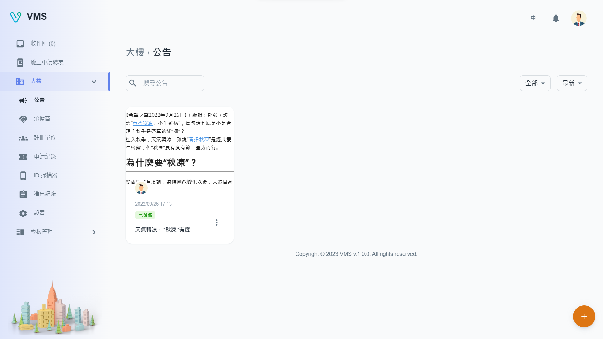
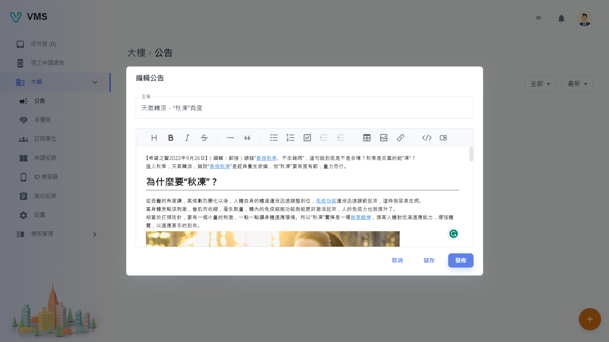

import BrowserWindow from '@site/src/components/BrowserWindow'

<BrowserWindow url={'https://vms.cesbg.efoxconn.com/bm/building/announcements'}>

</BrowserWindow>

# 描述

“公告”允許用戶以網格查看與大樓相關的公告。 用戶可以按狀態過濾公告，並按發佈時間對公告進行排序。 用戶還可以在此頁面上創建、編輯或刪除公告。

## 創建

要創建公告，需要以下欄位：

- 標題
- 內容：此欄位為 WYSIWYG 編輯器，允許用戶複製和粘貼內容，同時保持其原始格式。

完成所有必填欄位後，用戶可以選擇`儲存`或`發布`公告。

- 儲存：已儲存，但不會發布給租戶。
- 發布：已儲存並發布給租戶。

<BrowserWindow url={'https://vms.cesbg.efoxconn.com/bm/building/announcements'}>

</BrowserWindow>

## 編輯

當用戶點擊“更多”選單中的“編輯”時，會在對話框中顯示相關公告的可編輯信息。 所有顯示的欄位都可以編輯。

<BrowserWindow url={'https://vms.cesbg.efoxconn.com/bm/building/announcements'}>

</BrowserWindow>

## 刪除

當用戶點擊“更多”選單中的“刪除”時，會彈出一個警告對話框，再次確認並提醒用戶刪除操作不可逆。
