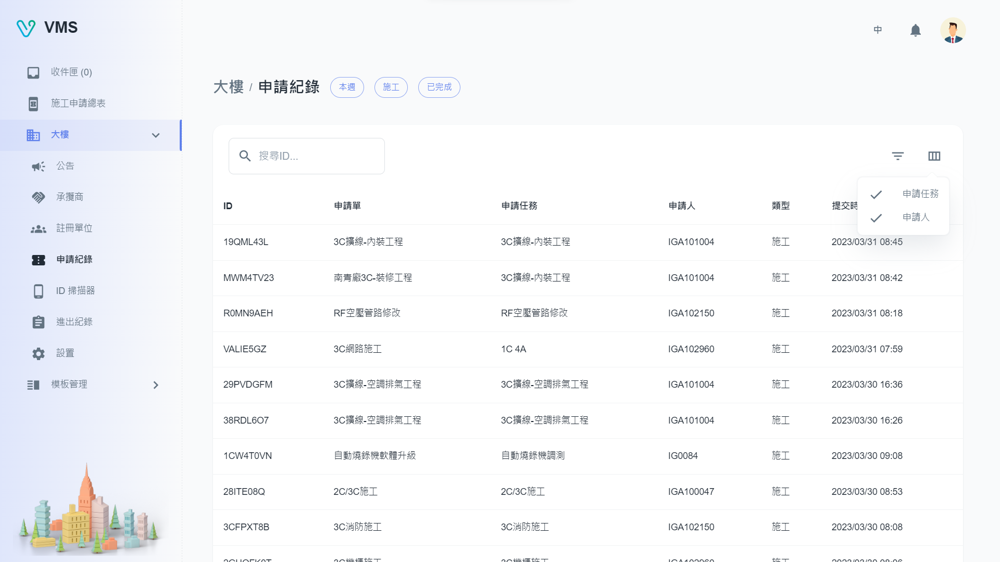

import BrowserWindow from '@site/src/components/BrowserWindow'

<BrowserWindow url={'https://vms.ces.myfiinet.com/bm/building/application-records'}>

</BrowserWindow>

# 描述

在“申請記錄”，用戶可以查看該大樓的歷史申請單。 可根據特定條件或申請單 ID 過濾記錄。 此外，用戶可以使用“自定義表格列”按鈕顯示“申請任務”和“申請人”欄。
