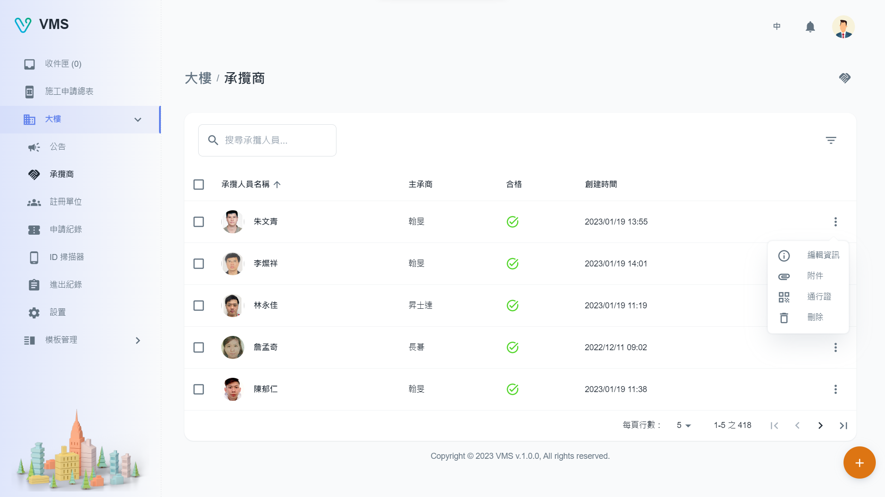
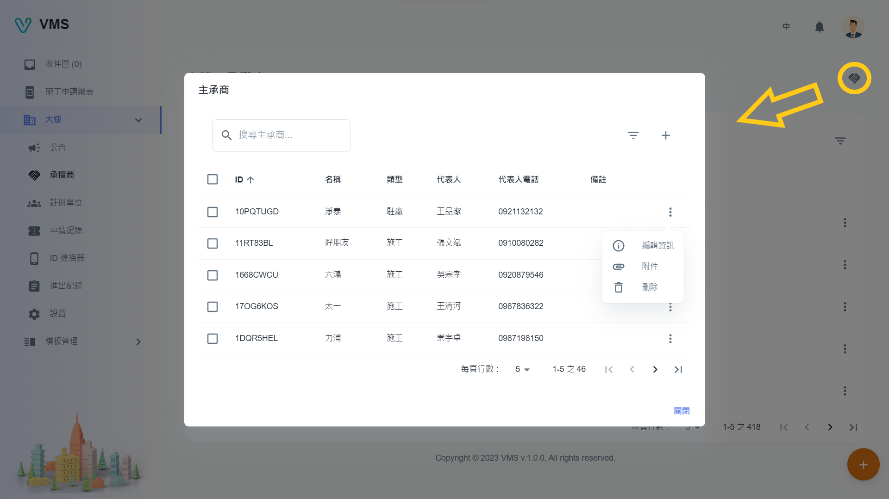
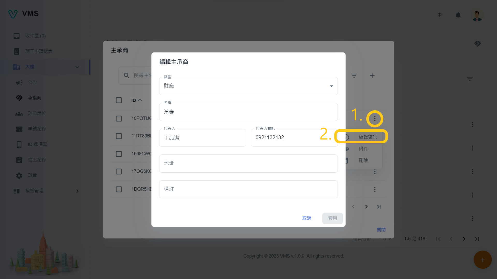
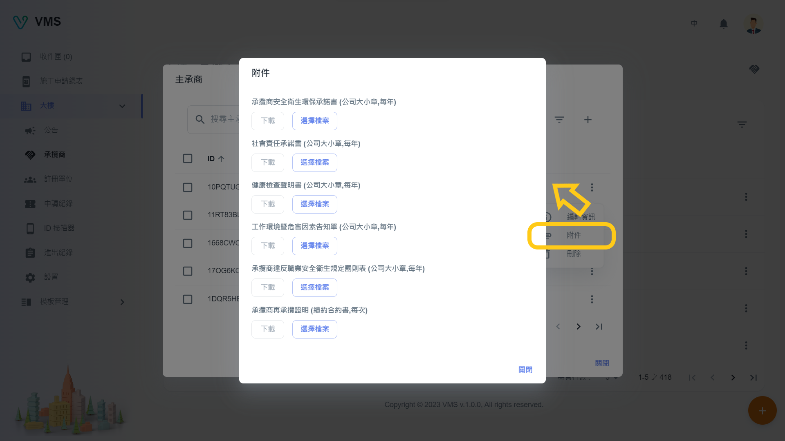
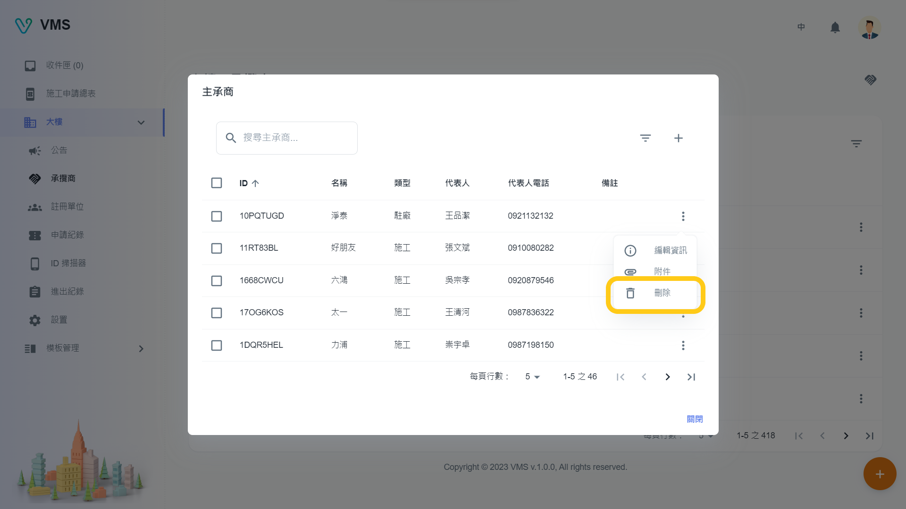
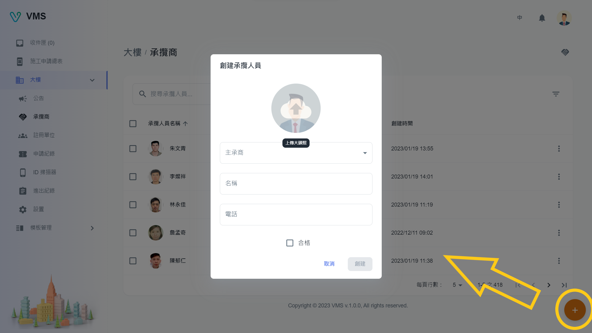
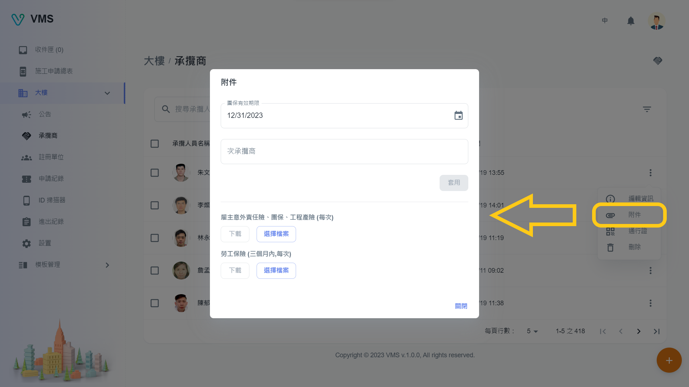
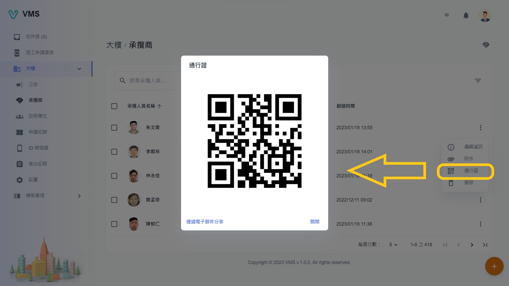
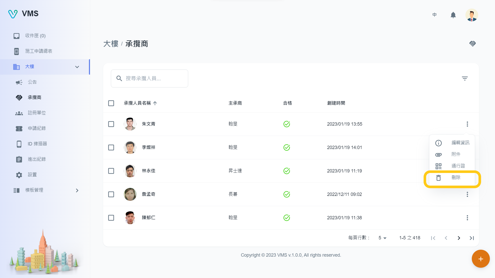

import BrowserWindow from '@site/src/components/BrowserWindow'

<BrowserWindow url={'https://vms.cesbg.efoxconn.com/bm/building/contractors'}>

</BrowserWindow>

＃ 描述

在“承攬商”頁面上，用戶可以查看與大樓相關的“承攬人員”表。他們能夠根據特定條件或姓名過濾人員，為每個人執行 CRUD（創建、讀取、更新、刪除）功能，上傳附件，並檢視通行碼。 通過點擊位於右上角的按鈕（🤝），用戶可以訪問“承攬商”對話框。 在此對話框中，用戶可以根據特定條件或名稱應用其他過濾器、使用 CRUD 功能管理承攬商以及上傳附件。

## 打開承攬商

在創建人員之前，需要先創建承攬商，用戶可以點擊位於右上角的“承攬商”按鈕 (🤝)，這會打開一個對話框。 該對話框顯示可用承攬商表，以及用於查找特定承攬商的搜索欄和過濾器選項。 要添加新承攬商，用戶可以點擊“添加”按鈕 (➕)。

<BrowserWindow url={'https://vms.cesbg.efoxconn.com/bm/building/contractors'}>

</BrowserWindow>

## 承攬商

在 VMS 中，租戶可以為“施工”和“駐廠”類型的施工單選擇承攬商。

:::note
在 BM 中所有承攬商都被認為是合格的。
:::

### 創建

要創建承攬商，需要以下欄位：

- 類型
- 姓名
- 代表人
- 代表人電話

以下欄位為選填：

- 地址
- 備註

<BrowserWindow url={'https://vms.cesbg.efoxconn.com/bm/building/contractors'}>

</BrowserWindow>

:::note
當用戶點擊承攬商表中的“更多”按鈕時，每行末尾都會顯示“編輯資訊”、“附件”、“刪除”等相關選項。
:::

### 編輯

當用戶點擊“更多”選單中的“編輯”時，會在對話框中顯示相關承攬商的可編輯信息。 所有顯示的欄位都可以編輯。

<BrowserWindow url={'https://vms.cesbg.efoxconn.com/bm/building/contractors'}>

</BrowserWindow>

### 上傳附件

當用戶點擊“更多”選單中的“附件”時，將顯示一個對話框，顯示承攬商必須上傳的附件才能成為合格廠商。

<BrowserWindow url={'https://vms.cesbg.efoxconn.com/bm/building/contractors'}>

</BrowserWindow>

### 刪除

當用戶點擊“更多”選單中的“刪除”時，會彈出一個警告對話框，再次確認並提醒用戶刪除操作不可逆。

<BrowserWindow url={'https://vms.cesbg.efoxconn.com/bm/building/contractors'}>

</BrowserWindow>

## 承攬人員

在 VMS 中，租戶可以為“施工”和“駐廠”類型的施工單選擇承攬人員。

:::note
在 BM 中所有承攬人員都被認為是合格的。
:::

### 創建

要創建承攬人員，需要以下欄位：

- 大頭照
- 所屬承攬商
- 名稱

以下欄位為選填：

- 電話
- 合格

<BrowserWindow url={'https://vms.cesbg.efoxconn.com/bm/building/contractors'}>

</BrowserWindow>

### 編輯

當用戶點擊“更多”選單中的“編輯”時，會在對話框中顯示相關承攬人員的可編輯信息。 所有顯示的欄位都可以編輯。

<BrowserWindow url={'https://vms.cesbg.efoxconn.com/bm/building/contractors'}>

</BrowserWindow>

### 上傳附件

當用戶點擊“更多”選單中的“附件”時，將顯示一個對話框，顯示承攬人員必須上傳的附件才能成為合格人員。

<BrowserWindow url={'https://vms.cesbg.efoxconn.com/bm/building/contractors'}>

</BrowserWindow>

### 通行碼

通行碼可以與 Upass 配合使用，能夠顯示人員可以通行的申請單。 一旦通過，VMS 將在“進出紀錄”和“ID 掃描器”頁面中留下記錄。 通行碼可以通過電子郵件共享或下載圖像。

<BrowserWindow url={'https://vms.cesbg.efoxconn.com/bm/building/contractors'}>

</BrowserWindow>

### 刪除

當用戶點擊“更多”選單中的“刪除”時，會彈出一個警告對話框，再次確認並提醒用戶刪除操作不可逆。

<BrowserWindow url={'https://vms.cesbg.efoxconn.com/bm/building/contractors'}>

</BrowserWindow>
