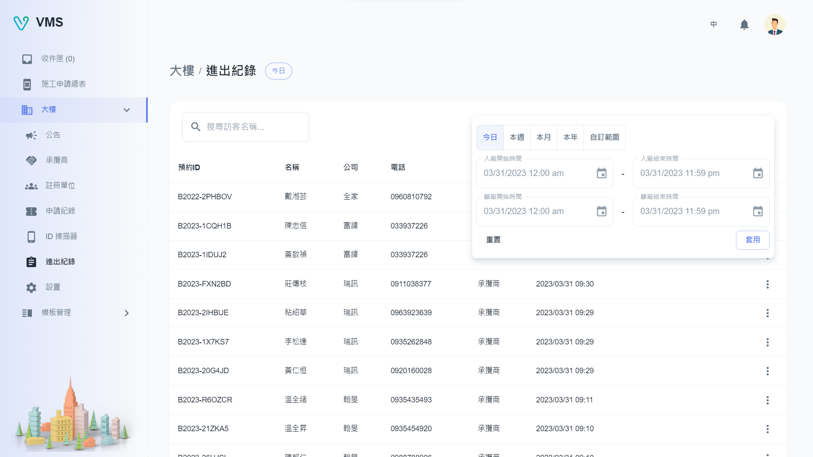

import BrowserWindow from '@site/src/components/BrowserWindow'

<BrowserWindow url={'https://vms.cesbg.efoxconn.com/bm/building/events'}>

</BrowserWindow>

# 描述

在“事件”頁面上，用戶可以查看大樓的進出記錄表。 他們能夠根據特定條件或訪問者名稱過濾事件。
