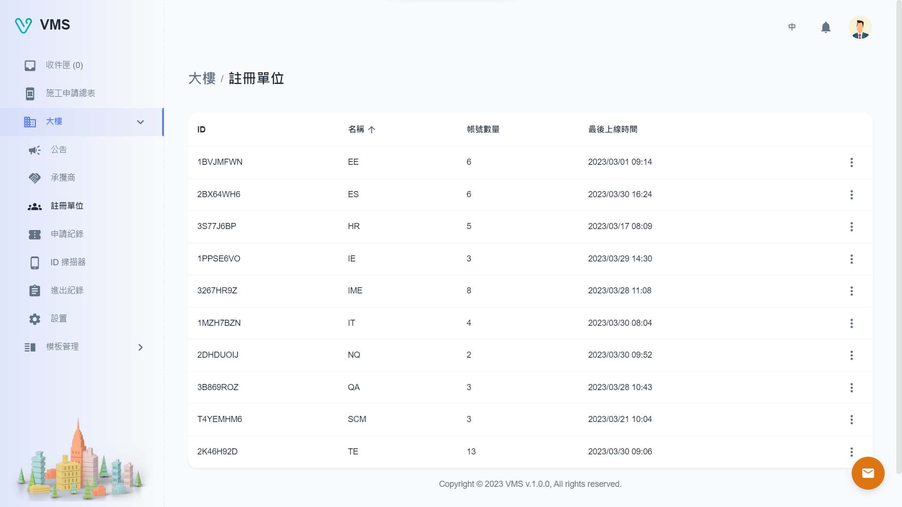
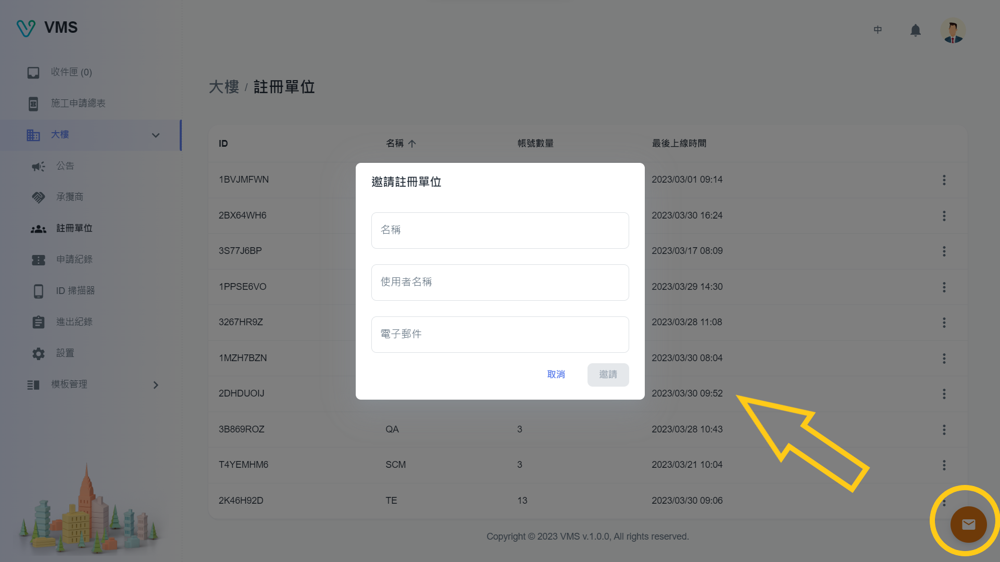

import BrowserWindow from '@site/src/components/BrowserWindow'

<BrowserWindow url={'https://vms.cesbg.efoxconn.com/bm/building/register-units'}>

</BrowserWindow>

# 描述

在“註冊單位”頁面上，用戶可以查看大樓所有已註冊單位。 成為註冊單位意味著該單位可以申請進入大樓，查看承攬商和人員名單，並接收已發布的公告。

## 邀請

要邀請單位，請按照下列步驟操作：

- 點擊頁面右下角的“邀請”按鈕。
- 將出現一個對話框，其中包含以下欄位：
  - 名稱
  - 使用者名稱
  - 電子郵件

<BrowserWindow url={'https://vms.cesbg.efoxconn.com/bm/building/register-units'}>

</BrowserWindow>

## 刪除

當用戶點擊“更多”選單中的“刪除”時，會彈出一個警告對話框，再次確認並提醒用戶刪除操作不可逆。
