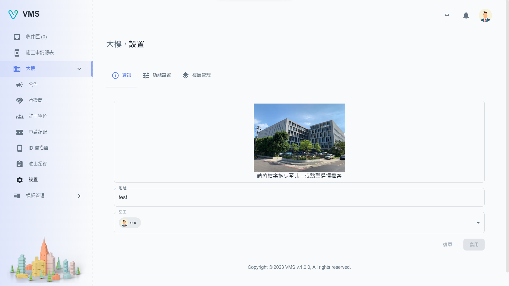
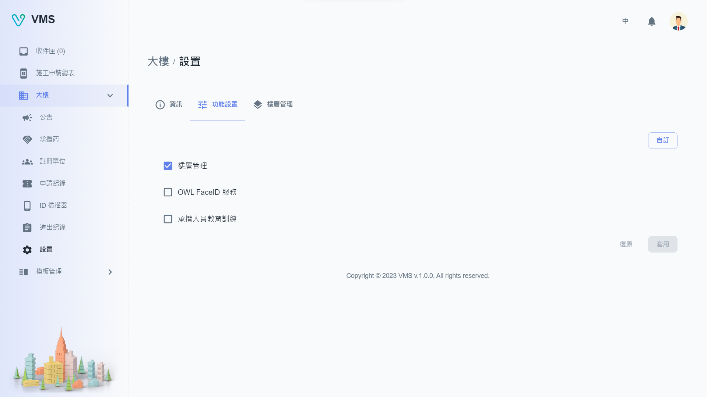
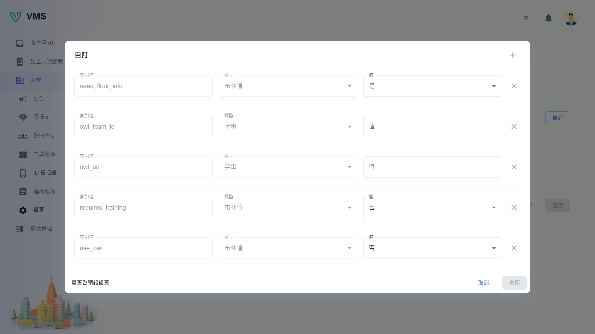
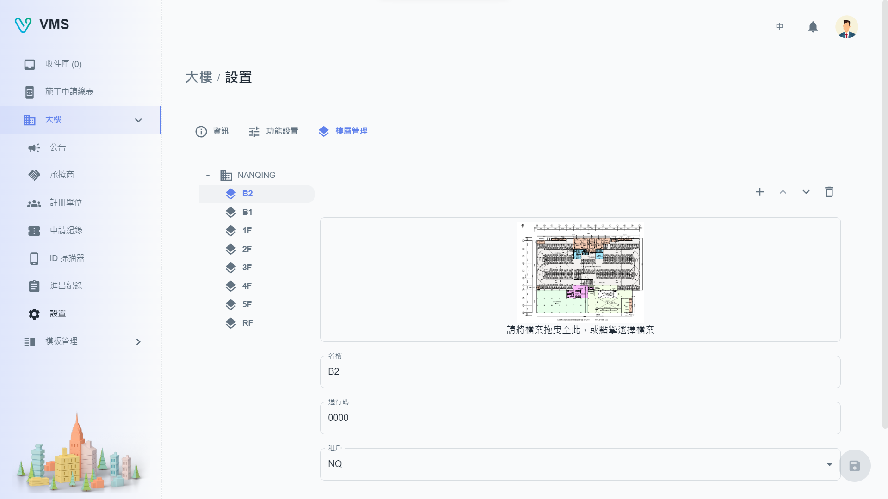

import BrowserWindow from '@site/src/components/BrowserWindow'

<BrowserWindow url={'https://vms.cesbg.efoxconn.com/bm/building/settings'}>

</BrowserWindow>

# 描述

“設置” 包含 “資訊”、“功能設置”、“樓層管理” 三個分頁。

## 資訊

用戶可以上傳大樓照片，也可以修改地址和堡主。

## 功能設置

允許用戶打開或關閉“樓層管理”、“OWL FaceID 服務”和“承攬人員教育訓練”等常用功能。如果用戶需要額外的功能，他們可以聯繫管理員做自定義配置。

<BrowserWindow url={'https://vms.cesbg.efoxconn.com/bm/building/settings'}>

</BrowserWindow>

<BrowserWindow url={'https://vms.cesbg.efoxconn.com/bm/building/settings'}>

</BrowserWindow>

## 樓層管理

用戶可以添加新樓層、上傳圖片、通行碼以及位於該樓層的租戶列表。

<BrowserWindow url={'https://vms.cesbg.efoxconn.com/bm/building/settings'}>

</BrowserWindow>

<BrowserWindow url={'https://vms.cesbg.efoxconn.com/bm/building/settings'}>

</BrowserWindow>
