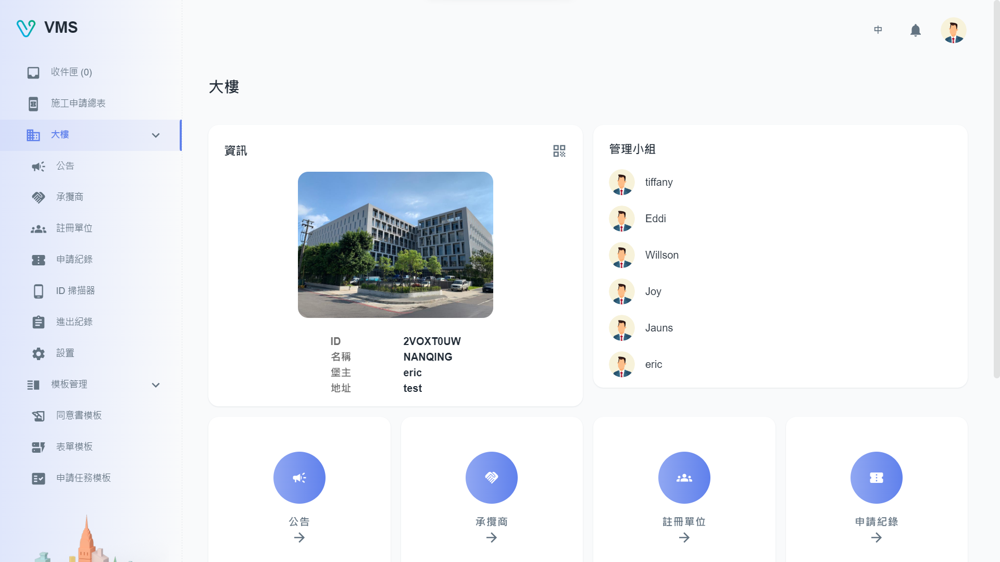

import BrowserWindow from '@site/src/components/BrowserWindow'

<BrowserWindow url={'https://vms.cesbg.efoxconn.com/bm/building'}>

</BrowserWindow>

# 什麼是樓管？

**樓管 (BM)** 是 VMS 平台的中心樞紐，旨在幫助物業經理有效地監督和運營其大樓。通過 BM，用戶可以利用廣泛的功能，包括：

- 承攬商
  - 承攬商和人員管理
  - 上傳附件
  - 入場證二維碼
  - 追蹤許可證到期日期的狀態
- 模板管理
  - 任務模板中的自定義表單
  - 表單模板中的自定義問題和簽核人
- 用戶管理
  - 創建用戶/管理員角色
- 進/出記錄
- 公告
  - 輕鬆向所有租戶發佈公告
  - 使用所見即所得的編輯器進行編輯
  - 狀態控制
- ID 掃描器
  - ID 掃描器管理
  - 單一掃描器的進/出記錄
