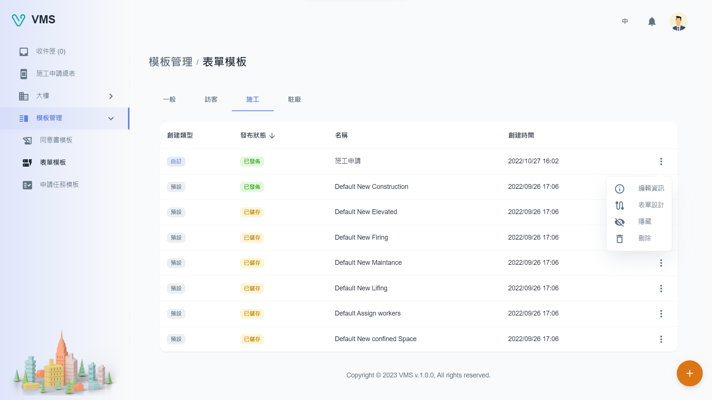
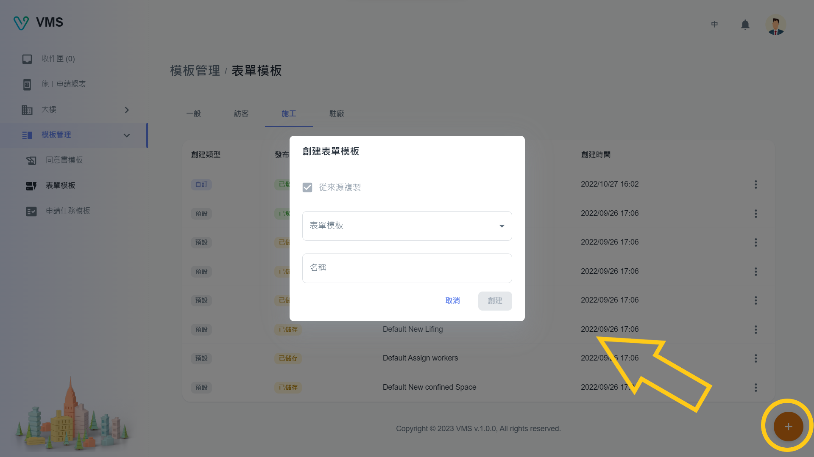
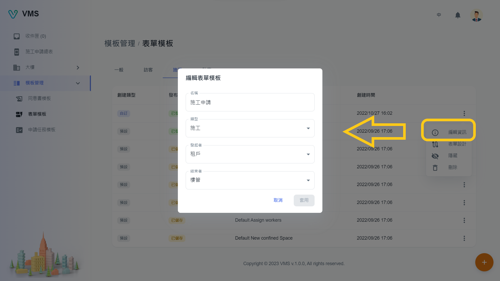
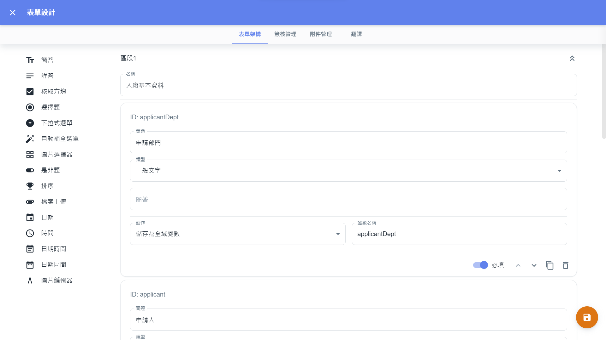
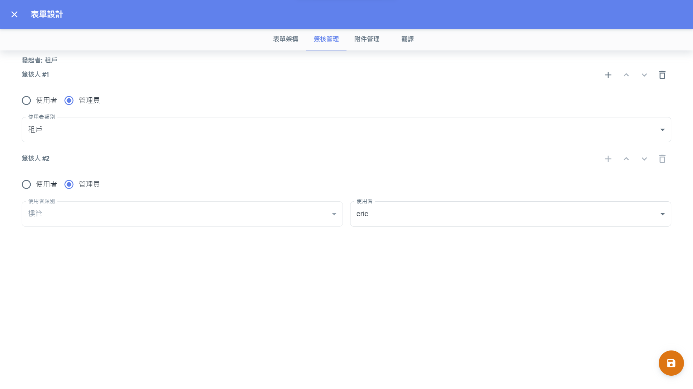
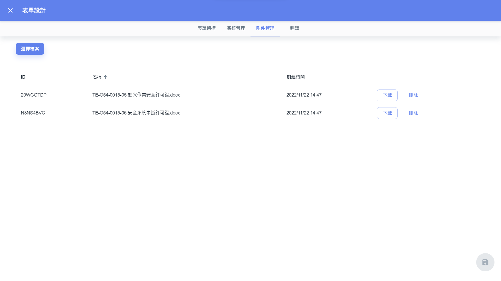
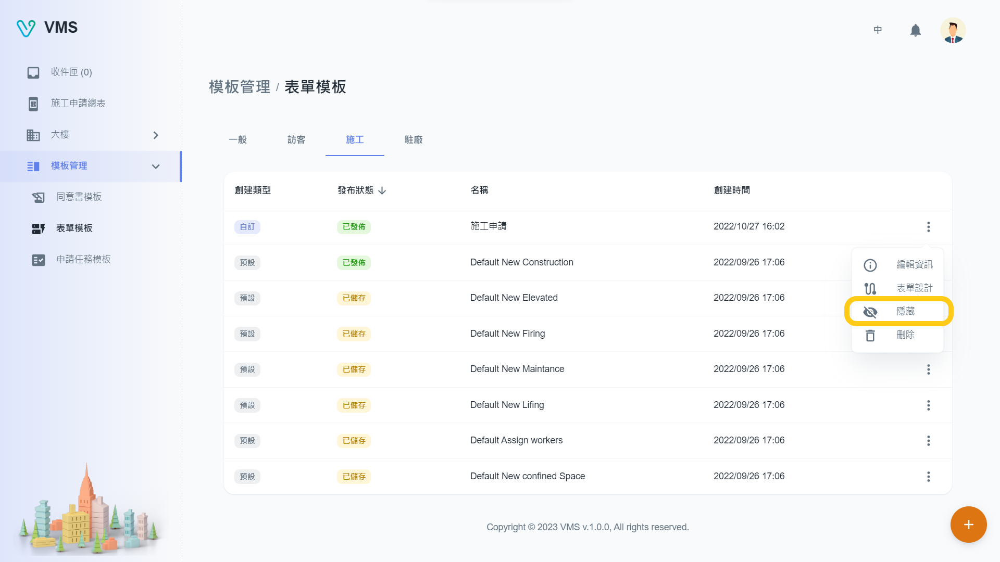

import BrowserWindow from '@site/src/components/BrowserWindow'
import Tabs from '@theme/Tabs'
import TabItem from '@theme/TabItem'

<BrowserWindow url={'https://vms.cesbg.efoxconn.com/bm/template-management/form-templates'}>

</BrowserWindow>

# 描述

在“表單模板”，用戶可以看到“一般”、“訪客”、“施工”、“駐廠”四個分頁，分別代表不同類型的表單模板。這些表單用於收集申請進入大樓的申請人信息。每個表單模板將在租戶介面中以申請單呈現。

在每種類型的表單模板表中，用戶可以看到以下列：

- “創建類型”：該欄表示表單模板是自訂還是預設的模板。 如果是“預設”模板，用戶不能修改表單內容或刪除； 他們只能修改表單模板的名稱。
- “發布狀態”：該欄表示表單模板是否已經發布給租戶。
- “名稱”
- “創建時間”

## 創建

要創建表單模板，需要以下欄位：

- 複製模板來源
- 名稱

<BrowserWindow url={'https://vms.cesbg.efoxconn.com/bm/template-management/form-templates'}>

</BrowserWindow>

## 編輯

創建表單模板後，用戶可以點擊“更多”按鈕中選單，以修改表單模板的信息、內容、簽核管理和相關附件。

### 資訊

當用戶點擊“更多”選單中的“編輯資訊”時，會在對話框中顯示相關表單模板的可編輯信息。 所有顯示的字段都可以編輯。

- “發起者”：指將發起申請單的身分。
- “結束者”：指將結束申請單的身分。

<BrowserWindow url={'https://vms.cesbg.efoxconn.com/bm/template-management/form-templates'}>

</BrowserWindow>

### 表單設計

點擊“更多”選單中的“表單設計”後，會向上滑動一個全屏對話框，呈現三個分頁：“表單架構”、“簽核管理”和“附件管理”。

<BrowserWindow url={'https://vms.cesbg.efoxconn.com/bm/template-management/form-templates'}>

</BrowserWindow>

#### 表單架構

<Tabs>
  <TabItem value="questionType" label="問題類型" default>
  在“表單架構”分頁中，用戶可以使用各種問題類型修改表單架構，包括：

- 文字
  - 簡答：一個“單行”文字欄位
  - 詳答：一個“多行”文字欄位
- 選擇
  - 核取方塊：包含多個選項的複選框組，其中可以選擇“多個”選項作為答案。
  - 選擇題：包含多個選項的單選組，其中可以選擇“一個”選項作為答案。
  - 下拉式選單：包含多個選項的下拉列表，其中可以選擇“一個/多個”選項作為答案。
  - 自動補全選單：包含多個選項的下拉列表，其中可以選擇“一個/多個”選項作為答案。 用戶還可以在文字欄位中輸入以過濾選項。
  - 🚧 圖片選擇器
- 是非題：以“是/否”作為答案的開關。
- 🚧 排序
- 🚧 檔案上傳
- 日期時間
  - 日期選擇器：返回“日期”作為答案的選擇器（例如 2023-04-07）。
  - 時間選擇器：返回“時間”作為答案的選擇器（例如 08:00）。
  - 日期時間選擇器：返回“日期時間”作為答案的選擇器（例如 2023-04-07 08:00）。
  - 日期範圍選擇器：返回“日期範圍”作為答案的選擇器（例如 2023-04-07 ~ 2023-04-08）。
- 圖片編輯器：允許用戶在圖像上添加註釋的編輯器，例如繪圖或文字。

:::note
符號 🚧 表示特定問題類型當前正在開發中，尚未發布。
:::

  </TabItem>

<TabItem value="attribute" label="屬性">

每種問題類型的共同屬性包括：

- 問題：問題的名稱
- 必填：問題是否必填

特定問題類型的獨特屬性包括：

- 簡答
  - 文字類型（普通文字/電話）
    - 普通文字：一個“純文字”字段
    - 電話：驗證給定國家/地區格式的“電話號碼”字段。
- 核取方塊
  - 最小/最大選擇：用戶可以選擇的選項數量
- 日期範圍選擇器
  - 最短/最長天數：用戶可以選擇的日期範圍數
  - 開始時間/結束時間：日期的開始時間/結束時間
- 自動補全選單
  - API：一個開關，可以使用來自系統的數據，例如“樓層”、“承攬商”和“承攬人員”。

</TabItem>

</Tabs>

<BrowserWindow url={'https://vms.cesbg.efoxconn.com/bm/template-management/form-templates'}>

</BrowserWindow>

#### 簽核管理

在發布表單模板之前，設置簽核流程非常重要。 用戶可以輕鬆配置在關閉申請單之前應有多少人簽核。

如果身分是租戶，則申請人將在申請單創建時指定簽核人。若是樓管的身分，則需要選擇一個用戶作為該階段的簽核人。 另外，用戶需要為每個階段分配合適權限的簽核人。

<BrowserWindow url={'https://vms.cesbg.efoxconn.com/bm/template-management/form-templates'}>

</BrowserWindow>

#### 附件管理

用戶可以上傳任何相關附件，在申請單獲得批准後，租戶可以下載這些附件。

<BrowserWindow url={'https://vms.cesbg.efoxconn.com/bm/template-management/form-templates'}>

</BrowserWindow>

### 發布狀態

用戶可以通過從“更多”選單中選擇“隱藏/發布”選項更改表單模板的狀態。

<BrowserWindow url={'https://vms.cesbg.efoxconn.com/bm/template-management/form-templates'}>

</BrowserWindow>

## 刪除

當用戶點擊“更多”選單中的“刪除”時，會彈出一個警告對話框，再次確認並提醒用戶刪除操作不可逆。
