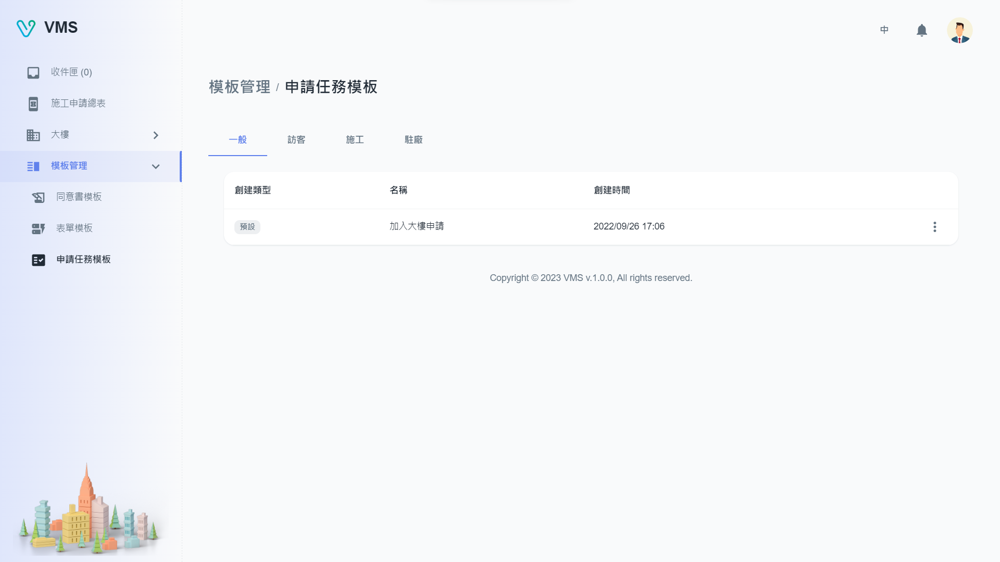
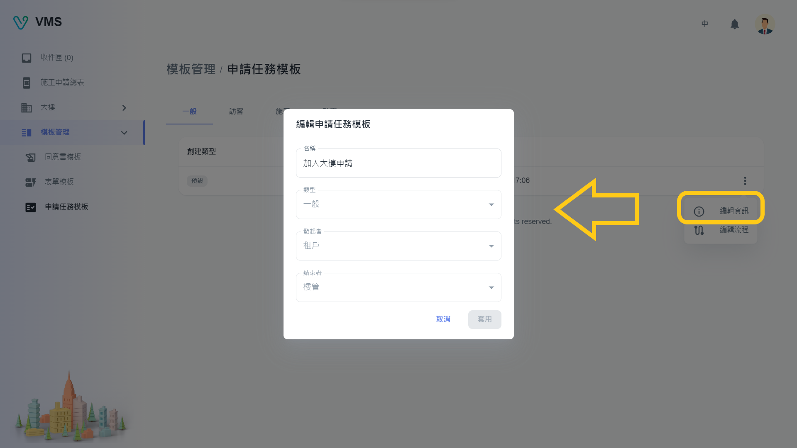
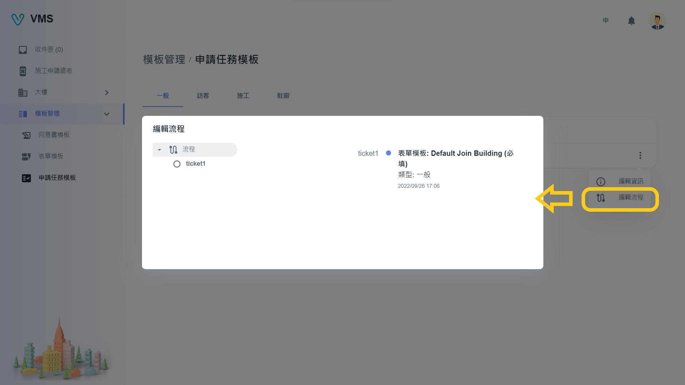
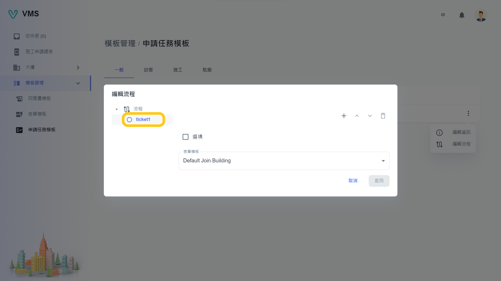

import BrowserWindow from '@site/src/components/BrowserWindow'

<BrowserWindow url={'https://vms.cesbg.efoxconn.com/bm/template-management/task-templates'}>

</BrowserWindow>

# 描述

“申請任務模板”包含四個分頁，名稱分別為“一般”、“訪客”、“施工”、“駐廠”。 這些分頁代表不同類型的任務模板，在租戶介面中以申請任務呈現。

每種類型的申請任務模板表包括以下列：

- 創建類型：該欄表示任務模板是自訂還是預設的模板。 如果是系統默認模板，用戶只能修改表單模板的名稱和流程。
- 名稱：此列顯示任務模板的名稱。
- 創建時間：此欄顯示創建任務模板的日期和時間。

## 編輯

目前，我們只發布了預設的任務模板。 用戶可以通過單擊表格最後一列中的“更多”選單並選擇所需的選項來修改任務模板的名稱和流程。

### 資訊

<BrowserWindow url={'https://vms.cesbg.efoxconn.com/bm/template-management/task-templates'}>

</BrowserWindow>

### 流程

用戶可以添加流程和選擇表單模板。用戶還可以決定每個階段是否選填。

<BrowserWindow url={'https://vms.cesbg.efoxconn.com/bm/template-management/task-templates'}>

</BrowserWindow>

<BrowserWindow url={'https://vms.cesbg.efoxconn.com/bm/template-management/task-templates'}>

</BrowserWindow>
