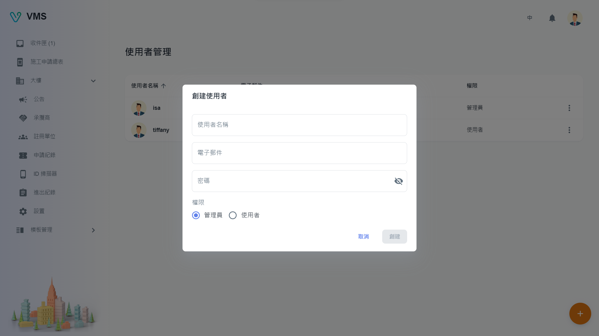

import BrowserWindow from '@site/src/components/BrowserWindow'

<BrowserWindow url={'https://vms.cesbg.efoxconn.com/bm/user-management'}>

</BrowserWindow>

# 描述

開始使用 VMS 前，用戶需要先驗證他們的電子郵件。 一旦通過驗證，可通過右上角的頭像來檢視個人資訊。 內含：用戶名稱、權限和電子郵件。此外，在下方可以找到`個人資訊`和`用戶管理`。

## 當前用戶

“個人資訊”允許用戶修改他們的個人信息，例如：

- 用戶名稱
- 電子郵件
- 密碼

<BrowserWindow url={'https://vms.cesbg.efoxconn.com/bm/user-management'}>

</BrowserWindow>

## 用戶管理

“用戶管理”提供了建立用戶為管理員或普通用戶的功能。

管理員擁有執行各種功能的完整權限，包括：

- 用戶管理
- 大樓管理
- 模板管理

普通用戶只有檢視權限。

### 創建

要創建用戶，需要以下欄位：

- 用戶名稱
- 電子郵件
- 密碼
- 權限

<BrowserWindow url={'https://vms.cesbg.efoxconn.com/bm/user-management'}>

</BrowserWindow>

### 編輯

當用戶點擊“更多”選單中的“編輯”時，會在對話框中顯示相關用戶的可編輯信息。 所有顯示的欄位都可以編輯。

<BrowserWindow url={'https://vms.cesbg.efoxconn.com/bm/user-management'}>

</BrowserWindow>

### 刪除

當用戶點擊“更多”選單中的“刪除”時，會彈出一個警告對話框，再次確認並提醒用戶刪除操作不可逆。
