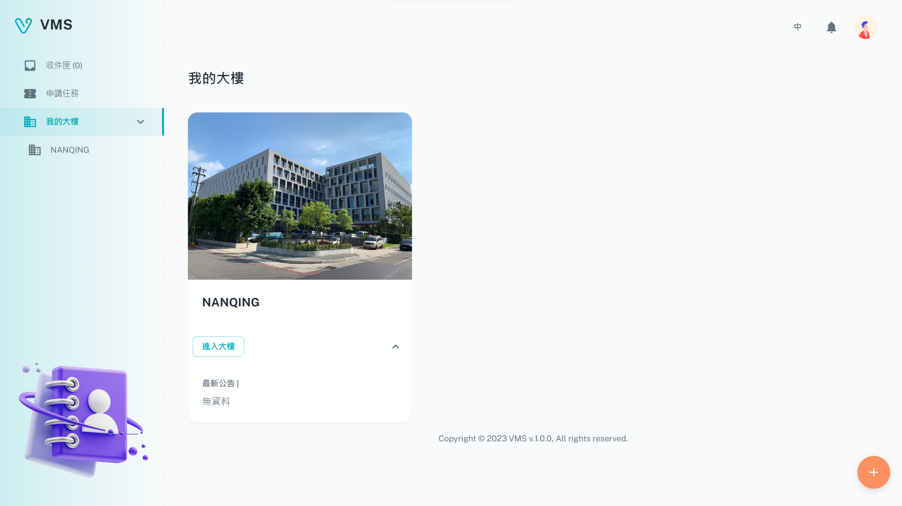
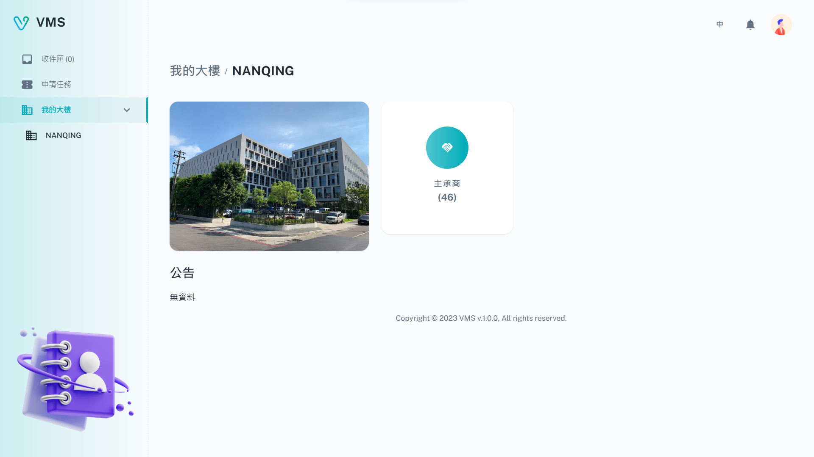
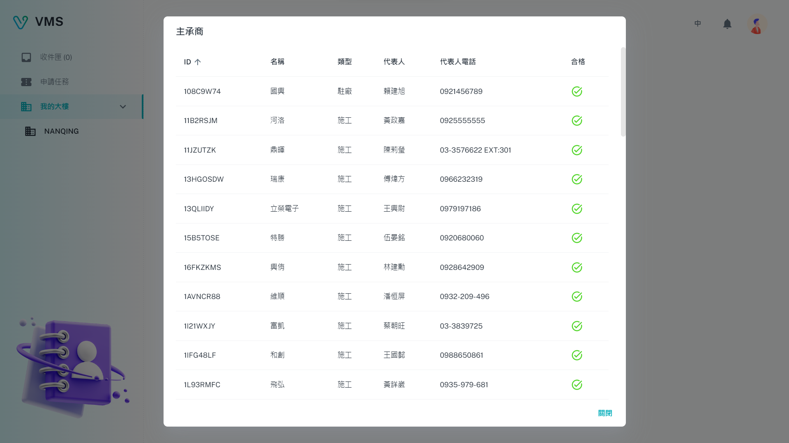

import BrowserWindow from '@site/src/components/BrowserWindow'

<BrowserWindow url={'https://vms.cesbg.efoxconn.com/vms/my-buildings'}>

</BrowserWindow>

＃ 描述

**我的大樓**允許用戶檢視已註冊大樓的最新公告，與申請其他大樓的註冊單位。

## 大樓資訊

用戶點擊**進入大樓**按鈕後，他們將能夠訪問與大樓相關的所有相關信息，例如公告、承攬商和承攬人員詳細信息。

<BrowserWindow url={'https://vms.cesbg.efoxconn.com/vms/my-buildings/{buildingId}'}>

</BrowserWindow>

<BrowserWindow url={'https://vms.cesbg.efoxconn.com/vms/my-buildings/{buildingId}'}>

</BrowserWindow>

<BrowserWindow url={'https://vms.cesbg.efoxconn.com/vms/my-buildings/{buildingId}'}>

</BrowserWindow>
