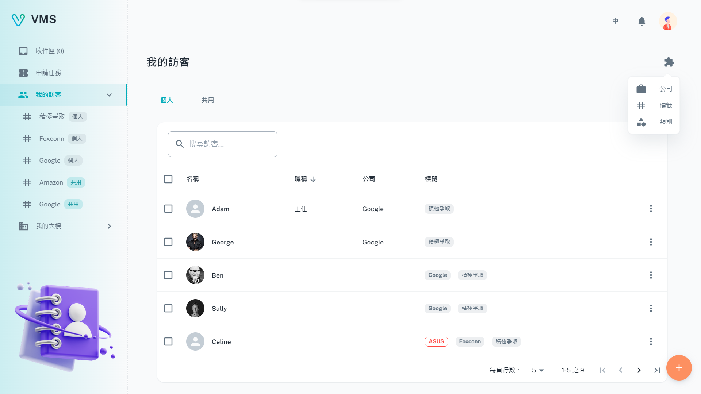
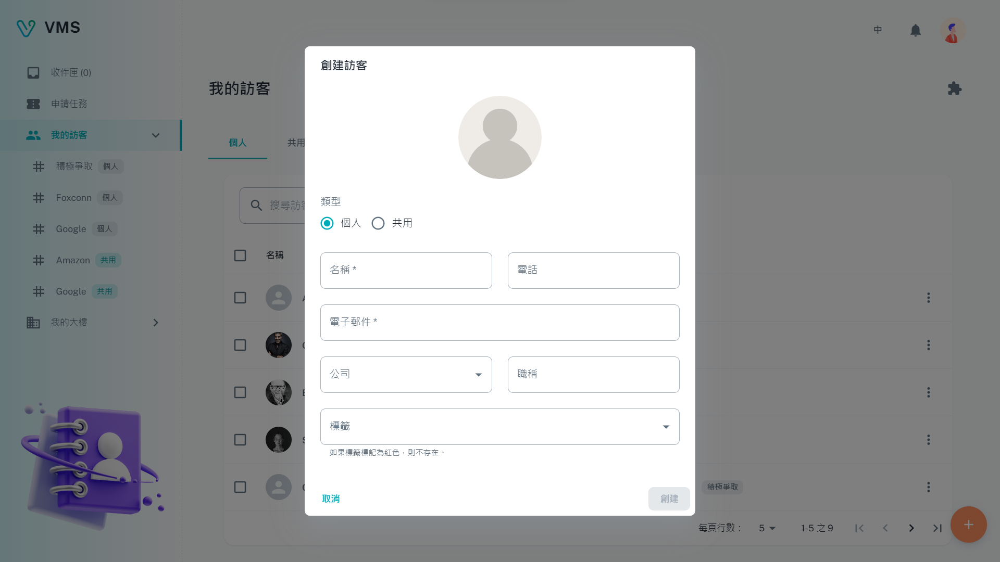
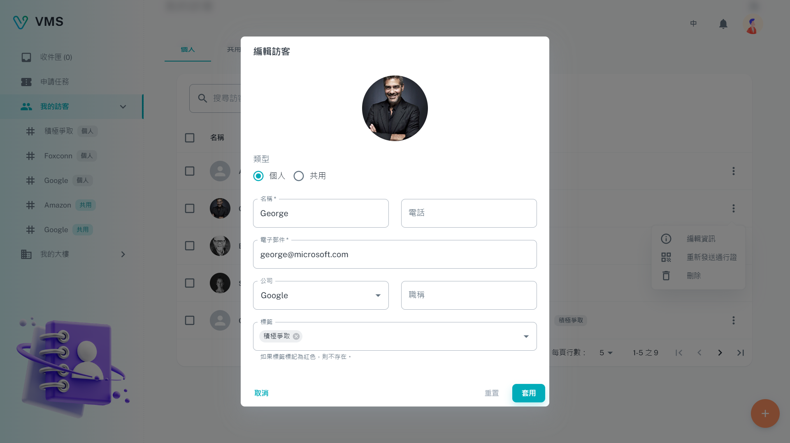
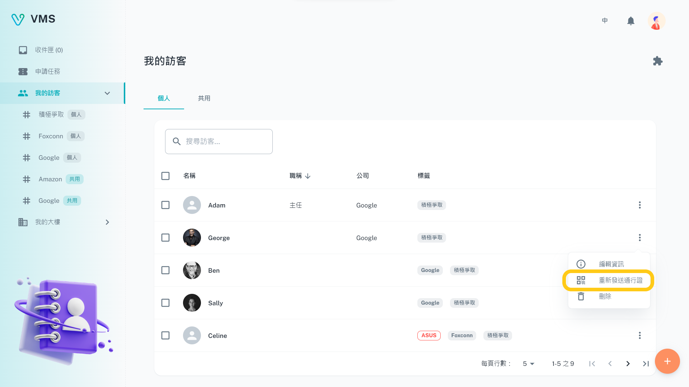
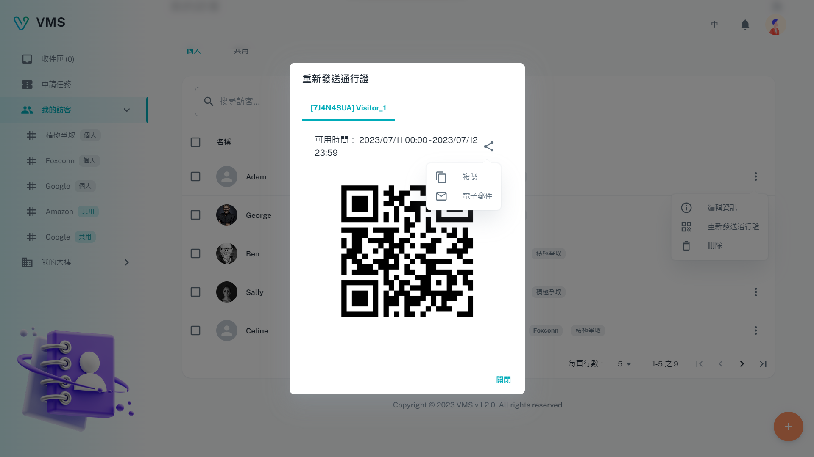
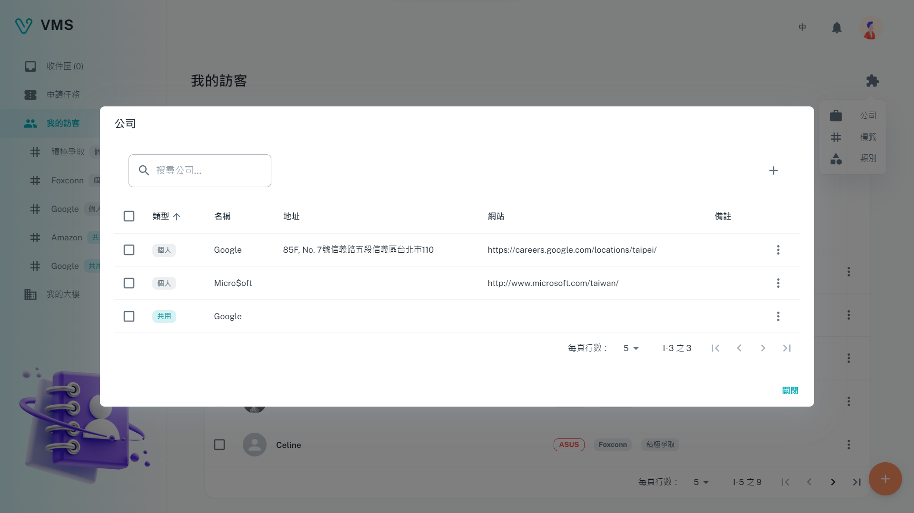
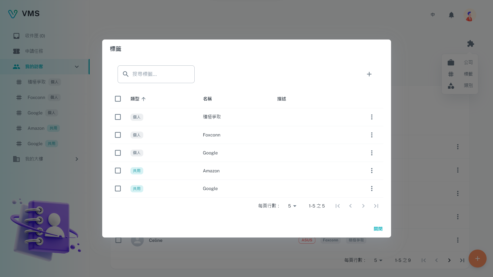
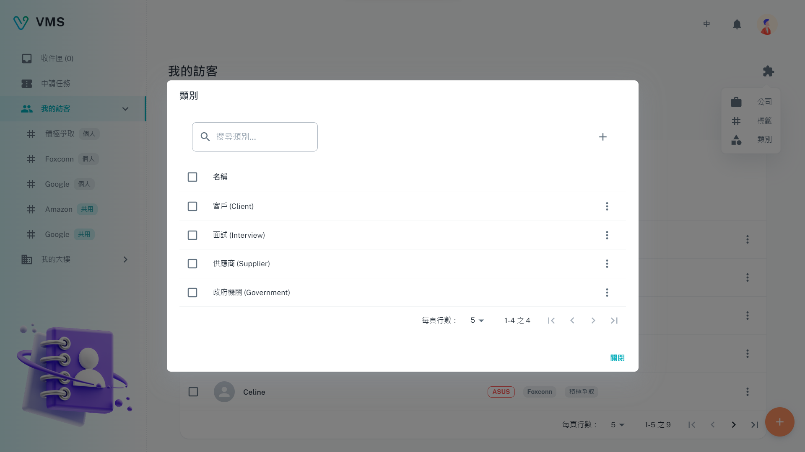

import BrowserWindow from '@site/src/components/BrowserWindow'

<BrowserWindow url={'https://vms.ces.myfiinet.com/vms/my-visitors'}>

</BrowserWindow>

＃ 描述

**我的訪客**提供了使用者管理其訪客的功能。這包括新增、編輯和刪除訪客。使用者還可以按照訪客的姓名進行搜索。此外，該頁面還允許使用者與同一公司的其他人分享他們的訪客。在此頁面上，訪客可以分為三個類別：`公司`、`標籤`和`類別`。

## 訪客

此頁面包含一個表格，顯示以下欄位：

- 頭像和姓名
- 職稱
- 公司
- 標籤

### 創建

要創建訪客，需要以下欄位：

- 類型：訪客的類型。
- 名稱：用於記錄訪客的名稱。
- 電子郵件：用於發送入廠通行證的電子郵件地址。

以下欄位為選填：

- 電話
- 公司
- 職稱
- 標籤

<BrowserWindow url={'https://vms.ces.myfiinet.com/vms/my-visitors'}>

</BrowserWindow>

### 編輯

當用戶點擊“更多”選單中的“編輯”時，會在對話框中顯示相關訪客的可編輯信息。 所有顯示的欄位都可以編輯。

<BrowserWindow url={'https://vms.ces.myfiinet.com/vms/my-visitors'}>

</BrowserWindow>

### 重新發送通行證

當用戶點擊“更多”選單中的“重新發送通行證”時，將顯示一個對話框，顯示相關預約記錄列表。 通行證可以通過複製或電子郵件共享。

<BrowserWindow url={'https://vms.ces.myfiinet.com/vms/my-visitors'}>

</BrowserWindow>

<BrowserWindow url={'https://vms.ces.myfiinet.com/vms/my-visitors'}>

</BrowserWindow>

### 刪除

當用戶點擊“更多”選單中的“刪除”時，會彈出一個警告對話框，再次確認並提醒用戶刪除操作不可逆。

<BrowserWindow url={'https://vms.ces.myfiinet.com/vms/my-visitors'}>

</BrowserWindow>

## 延伸功能

### 公司

這是一個可用於管理公司的列表。 可以在此列表中添加、編輯和刪除公司。 對公司所做的任何修改都會自動與相應的訪客記錄同步。

<BrowserWindow url={'https://vms.ces.myfiinet.com/vms/my-visitors'}>

</BrowserWindow>

#### 創建

要創建公司，需要以下欄位：

- 類型
- 名稱

以下欄位為選填：

- 地址
- 網站
- 備註

#### 編輯

當用戶點擊“更多”選單中的“編輯”時，會在對話框中顯示相關公司的可編輯信息。 所有顯示的欄位都可以編輯。

#### 刪除

當用戶點擊“更多”選單中的“刪除”時，會彈出一個警告對話框，再次確認並提醒用戶刪除操作不可逆。

### 標籤

這是專門為標記訪客而設計的列表。 可以在此列表中添加、編輯和刪除標籤。 對標籤所做的任何更改都會自動與相應的訪客記錄同步。

<BrowserWindow url={'https://vms.ces.myfiinet.com/vms/my-visitors'}>

</BrowserWindow>

#### 創建

要創建標籤，需要以下欄位：

- 類型
- 名稱

以下欄位為選填：

- 描述

#### 編輯

當用戶點擊“更多”選單中的“編輯”時，會在對話框中顯示相關標籤的可編輯信息。 所有顯示的欄位都可以編輯。

#### 刪除

當用戶點擊“更多”選單中的“刪除”時，會彈出一個警告對話框，再次確認並提醒用戶刪除操作不可逆。

### 分類

這是一個可用於“訪客”申請單的類別列表。可以創建、編輯和刪除類別。

<BrowserWindow url={'https://vms.ces.myfiinet.com/vms/my-visitors'}>

</BrowserWindow>

#### 創建

要創建分類，需要以下欄位：

- 名稱

#### 編輯

當用戶點擊“更多”選單中的“編輯”時，會在對話框中顯示相關分類的可編輯信息。 所有顯示的欄位都可以編輯。

#### 刪除

當用戶點擊“更多”選單中的“刪除”時，會彈出一個警告對話框，再次確認並提醒用戶刪除操作不可逆。
